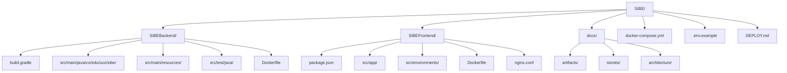
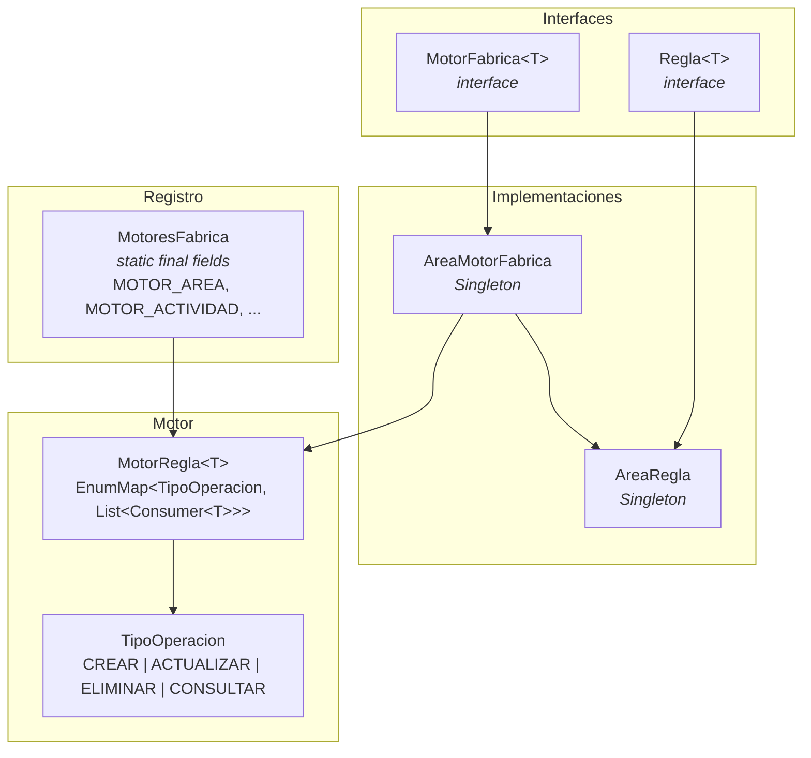
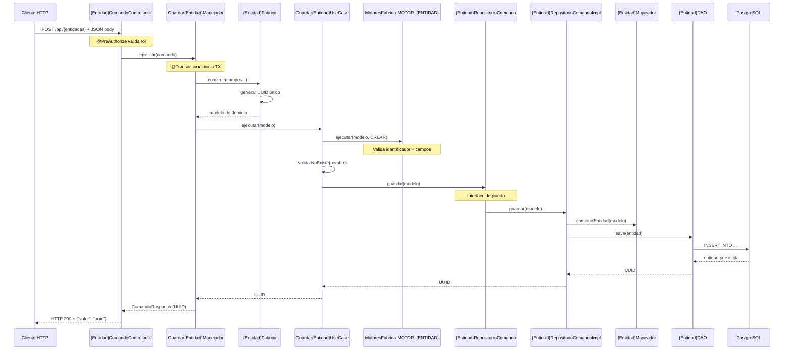
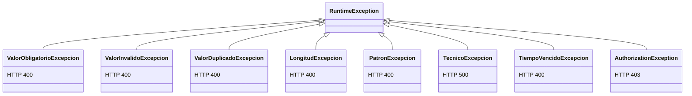
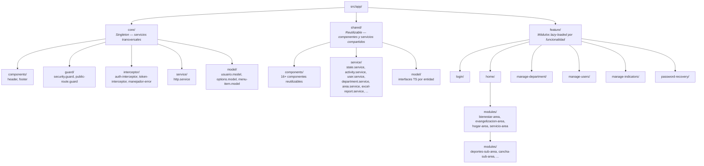
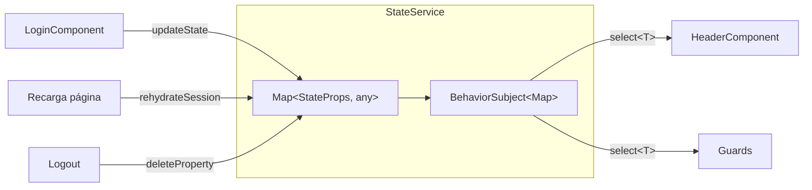
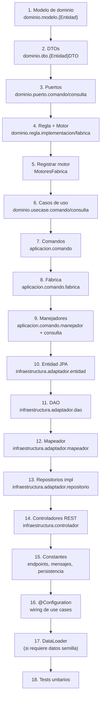
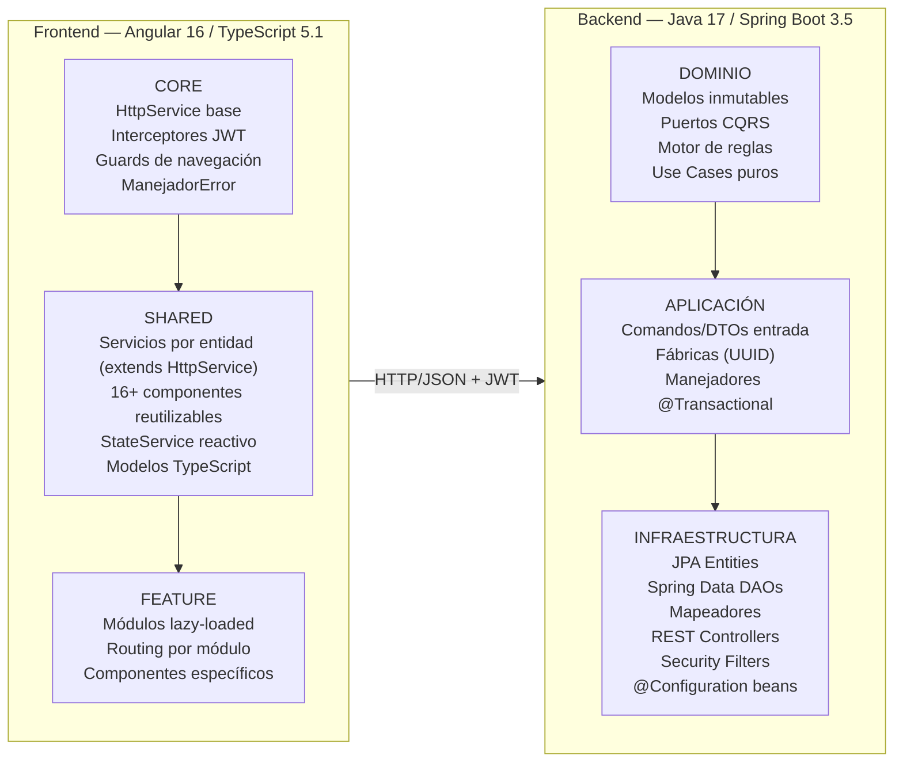

# 22. Arquetipo de Solución

## 1. Propósito y Alcance

Este documento define el **arquetipo de solución** del sistema SIBE (Sistema de Información de Bienestar Estudiantil): los patrones estructurales repetibles, las convenciones de nomenclatura, las plantillas de código y las guías paso a paso que un desarrollador debe seguir al agregar nuevas funcionalidades al proyecto. Sirve como guía normativa — no describe qué se construyó (eso es la Arquitectura de Referencia, artefacto 21), sino **cómo se debe construir** cada nuevo incremento.

**Audiencia:** Desarrolladores, tech leads, nuevos miembros del equipo, revisores de código.

**Alcance:** Cubre el arquetipo completo de backend (Java/Spring Boot) y frontend (Angular), incluyendo estructura de paquetes, patrones por capa, convenciones de nombres, y guías de implementación paso a paso.

**Relación con otros artefactos:**
- **Artefacto 21 — Arquitectura de Referencia:** Describe *qué* existe y las decisiones tomadas.
- **Artefacto 22 — Arquetipo de Solución (este documento):** Prescribe *cómo* implementar nuevas funcionalidades siguiendo los patrones existentes.

---

## 2. Estructura del Monorepo



| Componente | Tecnología | Build Tool | Puerto | Contenedor Docker |
|------------|-----------|------------|--------|-------------------|
| Backend | Java 17, Spring Boot 3.5.0 | Gradle 8.x | 8080 | `gradle:8-jdk17` → `eclipse-temurin:17-jre-alpine` |
| Frontend | Angular 16.2, TypeScript 5.1 | Angular CLI 16.2 | 80 (Nginx) / 4200 (dev) | `node:18-alpine` → `nginx:alpine` |
| Base de datos | PostgreSQL 16+ | DDL auto (Hibernate) | 5432 | `postgres:16-alpine` |

---

## 3. Arquetipo del Backend

### 3.1 Estructura de Paquetes

```mermaid
flowchart TD
    ROOT_PKG["co.edu.uco.sibe"] --> DOM["dominio"]
    ROOT_PKG --> APP["aplicacion"]
    ROOT_PKG --> INFRA["infraestructura"]

    DOM --> DOM_MOD["modelo<br/><i>Modelos de dominio inmutables</i>"]
    DOM --> DOM_DTO["dto<br/><i>DTOs de consulta</i>"]
    DOM --> DOM_ENUM["enums<br/><i>Enumeraciones de dominio</i>"]
    DOM --> DOM_PORT["puerto<br/><i>Interfaces de puertos</i>"]
    DOM --> DOM_UC["usecase<br/><i>Casos de uso</i>"]
    DOM --> DOM_SVC["service<br/><i>Servicios de dominio</i>"]
    DOM --> DOM_REGLA["regla<br/><i>Motor de reglas de validación</i>"]
    DOM --> DOM_TRANS["transversal<br/><i>Excepciones, constantes, utilitarios</i>"]

    DOM_PORT --> DOM_PORT_CMD["comando<br/><i>Puertos de escritura</i>"]
    DOM_PORT --> DOM_PORT_QRY["consulta<br/><i>Puertos de lectura</i>"]

    DOM_UC --> DOM_UC_CMD["comando<br/><i>UseCases de escritura</i>"]
    DOM_UC --> DOM_UC_QRY["consulta<br/><i>UseCases de lectura</i>"]

    APP --> APP_CMD["comando<br/><i>Objetos comando (DTOs de entrada)</i>"]
    APP --> APP_FAB["comando.fabrica<br/><i>Fábricas de aplicación</i>"]
    APP --> APP_MAN["comando.manejador<br/><i>Manejadores de comando</i>"]
    APP --> APP_CON["consulta<br/><i>Manejadores de consulta</i>"]
    APP --> APP_TRANS["transversal<br/><i>Interfaces de manejadores, ComandoRespuesta</i>"]

    INFRA --> INFRA_ENT["adaptador.entidad<br/><i>Entidades JPA</i>"]
    INFRA --> INFRA_DAO["adaptador.dao<br/><i>Repositorios Spring Data</i>"]
    INFRA --> INFRA_MAP["adaptador.mapeador<br/><i>Mapeadores Entidad↔Modelo</i>"]
    INFRA --> INFRA_REPO["adaptador.repositorio<br/><i>Implementaciones de puertos</i>"]
    INFRA --> INFRA_CTRL["controlador<br/><i>REST Controllers</i>"]
    INFRA --> INFRA_CFG["configuracion<br/><i>@Configuration beans, DataLoaders</i>"]
    INFRA --> INFRA_SEG["seguridad<br/><i>Filtros, providers, configuración JWT</i>"]
    INFRA --> INFRA_ERR["error<br/><i>@ControllerAdvice, ManejadorError</i>"]
```



### 3.2 Tabla de Convenciones de Nomenclatura

| Capa | Tipo de Clase | Sufijo/Patrón | Ejemplo |
|------|--------------|---------------|---------|
| Dominio | Modelo de dominio | `{Entidad}` | `Area`, `Actividad`, `EjecucionActividad` |
| Dominio | DTO de consulta | `{Entidad}DTO` / `{Entidad}DetalladaDTO` | `AreaDTO`, `AreaDetalladaDTO` |
| Dominio | Enum | `Tipo{Concepto}` / `{Concepto}` | `TipoArea`, `TipoOperacion` |
| Dominio | Puerto de comando | `{Entidad}RepositorioComando` | `AreaRepositorioComando` |
| Dominio | Puerto de consulta | `{Entidad}RepositorioConsulta` | `AreaRepositorioConsulta` |
| Dominio | Use case de comando | `Guardar{Entidad}UseCase` / `Eliminar{Entidad}UseCase` | `GuardarAreaUseCase` |
| Dominio | Use case de consulta | `Consultar{Entidad}{Variante}UseCase` | `ConsultarAreaDetalladaUseCase` |
| Dominio | Servicio de dominio | `{Verbo}{Concepto}Service` | `VincularActividadConAreaService` |
| Dominio | Regla de validación | `{Entidad}Regla` | `AreaRegla` |
| Dominio | Motor de fábrica | `{Entidad}MotorFabrica` | `AreaMotorFabrica` |
| Dominio | Excepción | `{Tipo}Excepcion` | `ValorObligatorioExcepcion`, `ValorDuplicadoExcepcion` |
| Aplicación | Objeto comando | `{Entidad}Comando` / `{Entidad}BaseComando` | `AreaComando`, `AreaBaseComando` |
| Aplicación | Fábrica | `{Entidad}Fabrica` | `AreaFabrica` |
| Aplicación | Manejador comando | `Guardar{Entidad}Manejador` / `Eliminar{Entidad}Manejador` | `GuardarAreaManejador` |
| Aplicación | Manejador consulta | `Consultar{Entidad}{Variante}Manejador` | `ConsultarAreasManejador` |
| Infraestructura | Entidad JPA | `{Entidad}Entidad` | `AreaEntidad` |
| Infraestructura | DAO (Spring Data) | `{Entidad}DAO` | `AreaDAO` |
| Infraestructura | Mapeador | `{Entidad}Mapeador` / `{Entidad}DetalladaMapeador` | `AreaMapeador` |
| Infraestructura | Repositorio impl | `{Entidad}Repositorio{Tipo}Implementacion` | `AreaRepositorioComandoImplementacion` |
| Infraestructura | Controlador | `{Entidad}{Tipo}Controlador` | `AreaConsultaControlador` |
| Infraestructura | DataLoader | `{Entidad}DataLoader` | `AreaDataLoader` |
| Infraestructura | Datos fábrica | `Datos{Entidad}Fabrica` | `DatosAreaFabrica` |

### 3.3 Idioma del Código

El proyecto sigue una política de **código en español**. Toda la nomenclatura de clases, métodos, variables, constantes y mensajes de error está en español, con las siguientes excepciones:
- Anotaciones y API de Spring/JPA (`@Entity`, `@Repository`, `@Override`, etc.)
- Interfaces genéricas de terceros (`JpaRepository`, `CommandLineRunner`, etc.)
- Keywords de Java (`extends`, `implements`, `return`, etc.)

---

## 4. Patrones por Capa — Backend

### 4.1 Capa de Dominio — Modelo

**Patrón:** Constructor privado + factory method estático `construir()`.

```java
// Plantilla: dominio.modelo.{Entidad}
@Getter
public class {Entidad} {
    private UUID identificador;
    private String nombre;
    // ... otros campos

    private {Entidad}(UUID identificador, String nombre /* ... */) {
        this.identificador = identificador;
        this.nombre = nombre;
    }

    // Factory con parámetros (para crear con datos reales)
    public static {Entidad} construir(UUID identificador, String nombre /* ... */) {
        return new {Entidad}(
            identificador,
            obtenerTextoPorDefecto(nombre)
            // ... sanitización de cada campo
        );
    }

    // Factory vacía (para inicialización por defecto)
    public static {Entidad} construir() {
        return new {Entidad}(
            obtenerValorDefecto(), // UUID por defecto
            VACIO                  // String vacío
            // ...
        );
    }
}
```

**Reglas del modelo de dominio:**
1. Clase `final`-style con **constructor privado** — instanciación exclusivamente vía `construir()`.
2. Solo `@Getter` de Lombok — **sin setters**; el modelo es inmutable tras construcción.
3. Sanitización de entrada en el factory usando utilitarios: `obtenerTextoPorDefecto()`, `obtenerObjetoPorDefecto()`.
4. Sin dependencias de Spring ni de infraestructura.

**Ejemplo real — `Area`:**

```java
@Getter
public class Area {
    private UUID identificador;
    private String nombre;
    private List<Subarea> subareas;
    private List<Actividad> actividades;

    private Area(UUID id, String nombre, List<Subarea> subareas, List<Actividad> actividades) { /* ... */ }

    public static Area construir(UUID id, String nombre, List<Subarea> s, List<Actividad> a) {
        return new Area(id, obtenerTextoPorDefecto(nombre),
                        obtenerObjetoPorDefecto(s, new ArrayList<>()),
                        obtenerObjetoPorDefecto(a, new ArrayList<>()));
    }

    public static Area construir() {
        return new Area(obtenerValorDefecto(), VACIO, new ArrayList<>(), new ArrayList<>());
    }
}
```

### 4.2 Capa de Dominio — DTOs

```java
// Plantilla: dominio.dto.{Entidad}DTO
@Getter @Setter @AllArgsConstructor @NoArgsConstructor
public class {Entidad}DTO {
    private String identificador;
    private String nombre;
    // ... campos planos para consultas
}
```

**Reglas:**
1. Son POJO mutables con Lombok (`@Getter @Setter @AllArgsConstructor @NoArgsConstructor`).
2. Usan `String` para UUIDs (serialización directa a JSON).
3. Variantes: `{Entidad}DTO` (resumen) y `{Entidad}DetalladaDTO` (con relaciones expandidas).

### 4.3 Capa de Dominio — Puertos (Interfaces)

```java
// Plantilla: dominio.puerto.comando.{Entidad}RepositorioComando
public interface {Entidad}RepositorioComando {
    UUID guardar({Entidad} modelo);
    // ... otros métodos de escritura
}

// Plantilla: dominio.puerto.consulta.{Entidad}RepositorioConsulta
public interface {Entidad}RepositorioConsulta {
    List<{Entidad}DTO> consultarDTOs();
    List<{Entidad}> consultarTodos();
    {Entidad} consultarPorIdentificador(UUID identificador);
    boolean hayDatos();
    {Entidad} consultarPorNombre(String nombre);
    {Entidad}DetalladaDTO consultarDetallePorIdentificador(UUID identificador);
}
```

**Reglas:**
1. Separación CQRS estricta: `puerto.comando` para escrituras, `puerto.consulta` para lecturas.
2. El puerto de comando retorna `UUID` (identificador del elemento persistido).
3. El puerto de consulta puede retornar modelos de dominio o DTOs.

### 4.4 Capa de Dominio — Motor de Reglas de Validación

El proyecto implementa un **motor de reglas** personalizado como patrón transversal para validación de dominio.



**Flujo de validación:**

```java
// 1. INTERFAZ base de regla
public interface Regla<T> {
    void validarIdentificador(UUID identificador);
    void validarCampos(T modelo);
}

// 2. IMPLEMENTACIÓN de regla (Singleton)
public final class AreaRegla implements Regla<Area> {
    private static final AreaRegla INSTANCIA = new AreaRegla();
    public static AreaRegla obtenerInstancia() { return INSTANCIA; }

    @Override
    public void validarCampos(Area modelo) {
        validarObligatorio(modelo.getNombre(), NOMBRE_AREA_OBLIGATORIO);
        validarTextoValido(modelo.getNombre(), NOMBRE_AREA_INVALIDO);
        validarNumeroEntre(modelo.getNombre().length(), 8, 70, LONGITUD_NOMBRE_AREA_INVALIDA);
    }
}

// 3. MOTOR FÁBRICA (asocia reglas a operaciones)
public class AreaMotorFabrica implements MotorFabrica<Area> {
    @Override
    public MotorRegla<Area> obtenerMotorReglas() {
        var motor = new MotorRegla<Area>();
        var regla = AreaRegla.obtenerInstancia();
        motor.agregarRegla(TipoOperacion.CREAR, m -> regla.validarIdentificador(m.getIdentificador()));
        motor.agregarRegla(TipoOperacion.CREAR, regla::validarCampos);
        motor.agregarRegla(TipoOperacion.ACTUALIZAR, m -> regla.validarIdentificador(m.getIdentificador()));
        motor.agregarRegla(TipoOperacion.ACTUALIZAR, regla::validarCampos);
        motor.agregarRegla(TipoOperacion.ELIMINAR, m -> regla.validarIdentificador(m.getIdentificador()));
        motor.agregarRegla(TipoOperacion.CONSULTAR, m -> regla.validarIdentificador(m.getIdentificador()));
        return motor;
    }
}

// 4. REGISTRO GLOBAL (inicialización estática)
MotoresFabrica.MOTOR_AREA  // = AreaMotorFabrica.obtenerInstancia().obtenerMotorReglas()

// 5. USO en un UseCase
MotoresFabrica.MOTOR_AREA.ejecutar(area, TipoOperacion.CREAR);
```

**Pasos para agregar validaciones a una nueva entidad:**
1. Crear `{Entidad}Regla implements Regla<{Entidad}>` (Singleton).
2. Crear `{Entidad}MotorFabrica implements MotorFabrica<{Entidad}>` (Singleton).
3. Agregar `MOTOR_{ENTIDAD}` como campo `static final` en `MotoresFabrica`.
4. Invocar `MotoresFabrica.MOTOR_{ENTIDAD}.ejecutar(modelo, tipoOperacion)` en los use cases.

### 4.5 Capa de Dominio — Casos de Uso

**Use Case de Comando (escritura):**

```java
// Plantilla: dominio.usecase.comando.Guardar{Entidad}UseCase
public class Guardar{Entidad}UseCase {
    private final {Entidad}RepositorioComando repositorioComando;
    private final {Entidad}RepositorioConsulta repositorioConsulta;

    public Guardar{Entidad}UseCase(/* inyección por constructor */) { /* ... */ }

    public UUID ejecutar({Entidad} modelo) {
        // 1. Validar reglas de negocio
        MotoresFabrica.MOTOR_{ENTIDAD}.ejecutar(modelo, TipoOperacion.CREAR);

        // 2. Validar unicidad (si aplica)
        validarNoExiste{Entidad}(modelo.getNombre());

        // 3. Persistir
        return this.repositorioComando.guardar(modelo);
    }

    private void validarNoExiste{Entidad}(String nombre) {
        if (!esNulo(repositorioConsulta.consultarPorNombre(nombre))) {
            throw new ValorDuplicadoExcepcion(NOMBRE_{ENTIDAD}_EXISTENTE);
        }
    }
}
```

**Use Case de Consulta (lectura):**

```java
// Plantilla: dominio.usecase.consulta.Consultar{Entidad}DetalladaUseCase
public class Consultar{Entidad}DetalladaUseCase {
    private final {Entidad}RepositorioConsulta repositorioConsulta;
    private final AutorizacionContextoOrganizacionalServicio autorizacionServicio;

    public {Entidad}DetalladaDTO ejecutar(UUID identificador) {
        // 1. Validar autorización organizacional
        autorizacionServicio.validarAccesoA{Entidad}(identificador);

        // 2. Consultar y validar existencia
        var resultado = repositorioConsulta.consultarDetallePorIdentificador(identificador);
        if (esNulo(resultado)) {
            throw new ValorInvalidoExcepcion(
                obtenerMensajeConParametro({ENTIDAD}_NO_ENCONTRADA_CON_ID, identificador));
        }
        return resultado;
    }
}
```

**Reglas de Use Cases:**
1. No dependen de Spring — son POJOs puros.
2. Reciben puertos de dominio por constructor (inyectados por `@Configuration` en infraestructura).
3. Siempre invocan el motor de reglas antes de persistir.
4. Consultas protegidas invocan `autorizacionServicio` antes de retornar datos.

### 4.6 Capa de Aplicación — Comandos

```java
// Plantilla: aplicacion.comando.{Entidad}Comando
@Getter @Setter @NoArgsConstructor @AllArgsConstructor
public class {Entidad}Comando {
    private String campo1;
    private String campo2;
    // ... campos planos (Strings) que vienen del request HTTP
}
```

### 4.7 Capa de Aplicación — Fábricas

```java
// Plantilla: aplicacion.comando.fabrica.{Entidad}Fabrica
@Component
@AllArgsConstructor
public class {Entidad}Fabrica {
    private final {Entidad}RepositorioConsulta repositorioConsulta;

    public {Entidad} construir(String nombre /* ... */) {
        return {Entidad}.construir(
            generar(uuid -> !esNulo(repositorioConsulta.consultarPorIdentificador(uuid))),
            nombre
            // ...
        );
    }
}
```

**Responsabilidades:**
1. Genera UUID único con `UtilUUID.generar(predicate)` — loop anti-colisión.
2. Transforma campos de comando (Strings) en modelo de dominio.
3. Es un `@Component` de Spring (única clase de aplicación con anotación Spring).

### 4.8 Capa de Aplicación — Manejadores

**Interfaces base:**

```java
// Escritura con comando y respuesta
public interface ManejadorComandoRespuesta<C, R> {
    @Transactional R ejecutar(C comando);
}

// Lectura sin comando
public interface ManejadorRespuesta<R> {
    @Transactional R ejecutar();
}

// Lectura con parámetro
public interface ManejadorComandoRespuesta<C, R> {
    @Transactional R ejecutar(C comando);
}

// Escritura con comando, parámetro y respuesta
public interface ManejadorComandoParametroRespuesta<C, P, R> {
    @Transactional R ejecutar(C comando, P parametro);
}
```

**Manejador de comando (escritura):**

```java
// Plantilla: aplicacion.comando.manejador.Guardar{Entidad}Manejador
@Component
@AllArgsConstructor
public class Guardar{Entidad}Manejador
        implements ManejadorComandoRespuesta<{Entidad}BaseComando, ComandoRespuesta<UUID>> {

    private final Guardar{Entidad}UseCase useCase;
    private final {Entidad}Fabrica fabrica;

    @Override
    public ComandoRespuesta<UUID> ejecutar({Entidad}BaseComando comando) {
        return new ComandoRespuesta<>(
            this.useCase.ejecutar(
                this.fabrica.construir(comando.getNombre() /* ... */)
            )
        );
    }
}
```

**Manejador de consulta (lectura):**

```java
// Plantilla: aplicacion.consulta.Consultar{Entidad}DetalladaManejador
@Component
@AllArgsConstructor
public class Consultar{Entidad}DetalladaManejador
        implements ManejadorComandoRespuesta<String, {Entidad}DetalladaDTO> {

    private final Consultar{Entidad}DetalladaUseCase useCase;

    @Override
    public {Entidad}DetalladaDTO ejecutar(String comando) {
        return useCase.ejecutar(UtilUUID.textoAUUID(comando));
    }
}
```

**Wrapper de respuesta:**

```java
@Getter @NoArgsConstructor
public class ComandoRespuesta<T> {
    private T valor;
    public ComandoRespuesta(T valor) { this.valor = valor; }
}
```

### 4.9 Capa de Infraestructura — Entidad JPA

```java
// Plantilla: infraestructura.adaptador.entidad.{Entidad}Entidad
@Getter @Setter @NoArgsConstructor @AllArgsConstructor
@Entity
@Table(name = TABLA_{ENTIDAD})
public class {Entidad}Entidad {
    @Id
    @Column(name = CAMPO_IDENTIFICADOR, nullable = false, updatable = false)
    private UUID identificador;

    @Column(name = CAMPO_NOMBRE, nullable = false, length = 70)
    private String nombre;

    // Relaciones
    @OneToMany(fetch = FetchType.LAZY)
    @JoinColumn(name = CAMPO_{PADRE})
    private List<{Hijo}Entidad> hijos;

    @OneToMany(fetch = FetchType.LAZY)
    @JoinTable(
        name = {TABLA_JOIN},
        joinColumns = @JoinColumn(name = CAMPO_{ENTIDAD}),
        inverseJoinColumns = @JoinColumn(name = CAMPO_{RELACION})
    )
    private List<{Relacion}Entidad> relaciones;
}
```

**Reglas:**
1. Nombres de tablas y columnas vienen de `PersistenciaConstante` — nunca hardcoded.
2. UUID como PK nativo — no generado por JPA.
3. Todas las relaciones son `FetchType.LAZY` (`spring.jpa.open-in-view=false`).
4. Lombok: `@Getter @Setter @NoArgsConstructor @AllArgsConstructor`.

### 4.10 Capa de Infraestructura — DAO (Spring Data)

```java
// Plantilla: infraestructura.adaptador.dao.{Entidad}DAO
public interface {Entidad}DAO extends JpaRepository<{Entidad}Entidad, UUID> {
    {Entidad}Entidad findByNombre(String nombre);
    {Entidad}Entidad findByActividades_Identificador(UUID actividadId);
    // ... query methods derivados
}
```

**Reglas:**
1. Extiende `JpaRepository<{Entidad}Entidad, UUID>`.
2. Usa query methods derivados de Spring Data (no `@Query` nativos).
3. Sin `@Repository` — Spring Data lo detecta automáticamente.

### 4.11 Capa de Infraestructura — Mapeadores

```java
// Plantilla: infraestructura.adaptador.mapeador.{Entidad}Mapeador
@Component
@AllArgsConstructor
public class {Entidad}Mapeador {
    // Dependencias de mapeadores hijos
    private final {Hijo}Mapeador hijoMapeador;

    public {Entidad}Entidad construirEntidad({Entidad} modelo) {
        return new {Entidad}Entidad(
            modelo.getIdentificador(),
            modelo.getNombre(),
            hijoMapeador.construirEntidades(modelo.getHijos())
        );
    }

    public {Entidad} construirModelo({Entidad}Entidad entidad) {
        return {Entidad}.construir(
            entidad.getIdentificador(),
            entidad.getNombre(),
            hijoMapeador.construirModelos(entidad.getHijos())
        );
    }

    public {Entidad}DTO construirDTO({Entidad}Entidad entidad) {
        return new {Entidad}DTO(
            entidad.getIdentificador().toString(),
            entidad.getNombre()
        );
    }

    // Métodos batch
    public List<{Entidad}Entidad> construirEntidades(List<{Entidad}> modelos) { /* stream().map() */ }
    public List<{Entidad}> construirModelos(List<{Entidad}Entidad> entidades) { /* stream().map() */ }
    public List<{Entidad}DTO> construirDTOs(List<{Entidad}Entidad> entidades) { /* stream().map() */ }
}
```

**Convenciones:**
1. Métodos: `construirEntidad()`, `construirModelo()`, `construirDTO()` + versiones `List` plurales.
2. Es `@Component` porque puede tener dependencias de otros mapeadores.
3. Mapeadores detallados separados: `{Entidad}DetalladaMapeador` para DTOs complejos.

### 4.12 Capa de Infraestructura — Implementaciones de Repositorio

```java
// Plantilla: infraestructura.adaptador.repositorio.comando.{Entidad}RepositorioComandoImplementacion
@Repository
@AllArgsConstructor
public class {Entidad}RepositorioComandoImplementacion implements {Entidad}RepositorioComando {
    private final {Entidad}DAO dao;
    private final {Entidad}Mapeador mapeador;

    @Override
    public UUID guardar({Entidad} modelo) {
        var entidad = mapeador.construirEntidad(modelo);
        return dao.save(entidad).getIdentificador();
    }
}

// Plantilla: infraestructura.adaptador.repositorio.consulta.{Entidad}RepositorioConsultaImplementacion
@Repository
@AllArgsConstructor
public class {Entidad}RepositorioConsultaImplementacion implements {Entidad}RepositorioConsulta {
    private final {Entidad}DAO dao;
    private final {Entidad}Mapeador mapeador;

    @Override
    public {Entidad} consultarPorIdentificador(UUID id) {
        var entidad = dao.findById(id).orElse(null);
        if (esNulo(entidad)) return null;
        return mapeador.construirModelo(entidad);
    }

    @Override
    public boolean hayDatos() {
        return esNumeroMayor(dao.count(), CERO);
    }
}
```

### 4.13 Capa de Infraestructura — Controlador REST

```java
// Plantilla controlador de CONSULTA
@RestController
@AllArgsConstructor
@RequestMapping({ENDPOINT_CONSTANTE})
public class {Entidad}ConsultaControlador {
    private final Consultar{Entidad}sManejador consultarTodosManejador;
    private final Consultar{Entidad}DetalladaManejador consultarDetalleManejador;

    @PreAuthorize(HAS_USER_OR_AREA_ADMIN_OR_ADMIN_GET_AUTHORITY)
    @GetMapping
    public List<{Entidad}DTO> consultarTodos() {
        return consultarTodosManejador.ejecutar();
    }

    @PreAuthorize(HAS_USER_OR_AREA_ADMIN_OR_ADMIN_GET_AUTHORITY)
    @GetMapping(RUTA_DETALLE)
    public {Entidad}DetalladaDTO consultarDetalle(@PathVariable String identificador) {
        return consultarDetalleManejador.ejecutar(identificador);
    }
}

// Plantilla controlador de COMANDO
@RestController
@AllArgsConstructor
@RequestMapping({ENDPOINT_CONSTANTE})
public class {Entidad}ComandoControlador {
    private final Guardar{Entidad}Manejador guardarManejador;

    @PreAuthorize(HAS_ADMIN_CREATE_AUTHORITY)
    @PostMapping
    public ComandoRespuesta<UUID> guardar(@RequestBody {Entidad}BaseComando comando) {
        return guardarManejador.ejecutar(comando);
    }
}
```

**Reglas:**
1. Controladores separados por tipo: `{Entidad}ConsultaControlador` y `{Entidad}ComandoControlador`.
2. Endpoints definidos en `ApiEndpointConstante` — nunca hardcoded.
3. Seguridad vía `@PreAuthorize` con constantes de `SeguridadConstante`.
4. El controlador solo delega al manejador — **cero lógica de negocio**.

### 4.14 Capa de Infraestructura — DataLoaders (Siembra de Datos)

```java
// Plantilla base abstracta
public abstract class DataLoader implements CommandLineRunner {
    @Override
    public final void run(String... args) {
        if (!debenCargarseDatos()) {
            cargarDatos();
        }
    }
    protected abstract boolean debenCargarseDatos();
    protected abstract void cargarDatos();
}

// Plantilla implementación
@Component
@Order({ORDEN_NUMERICO})
@RequiredArgsConstructor
public class {Entidad}DataLoader extends DataLoader {
    private final HayDatos{Entidad}Manejador hayDatosManejador;
    private final Guardar{Entidad}Manejador guardarManejador;

    @Override
    protected boolean debenCargarseDatos() {
        return hayDatosManejador.ejecutar(); // true = ya hay datos
    }

    @Override
    protected void cargarDatos() {
        Datos{Entidad}Fabrica.obtener{Entidad}s()
            .forEach(guardarManejador::ejecutar);
    }
}
```

### 4.15 Flujo Completo de una Petición — Diagrama de Secuencia



---

## 5. Manejo de Excepciones

### 5.1 Jerarquía de Excepciones



### 5.2 Mapeo Excepción → HTTP Status

| Excepción | HTTP Status | Uso |
|-----------|:-----------:|-----|
| `ValorObligatorioExcepcion` | 400 | Campo requerido faltante |
| `ValorInvalidoExcepcion` | 400 | Valor que no cumple regla de negocio |
| `ValorDuplicadoExcepcion` | 400 | Entidad con nombre/correo ya existente |
| `LongitudExcepcion` | 400 | Texto fuera de rango permitido |
| `PatronExcepcion` | 400 | Texto que no cumple regex |
| `TiempoVencidoExcepcion` | 400 | OTP expirado |
| `TecnicoExcepcion` | 500 | Error técnico inesperado |
| `AuthorizationException` | 403 | Violación de contexto organizacional |
| (cualquier otra) | 500 | Error genérico no mapeado |

### 5.3 Respuesta de Error

```java
public record Error(String nombreExcepcion, String mensaje) { }
// JSON: {"nombreExcepcion": "ValorDuplicadoExcepcion", "mensaje": "Ya existe un área con el nombre proporcionado"}
```

---

## 6. Arquetipo del Frontend

### 6.1 Estructura de Directorios



### 6.2 Patrón de Módulo Feature (Lazy-loaded)

Cada funcionalidad es un módulo Angular independiente cargado bajo demanda:

```
feature/{nombre-feature}/
├── {nombre-feature}.module.ts              // NgModule declaraciones + imports
├── {nombre-feature}-routing.module.ts      // RouterModule.forChild(routes)
├── components/
│   ├── {nombre-feature}.component.ts       // Componente raíz del módulo
│   ├── {nombre-feature}.component.html
│   ├── {nombre-feature}.component.scss
│   └── {sub-componente}/
│       ├── {sub-componente}.component.ts
│       ├── {sub-componente}.component.html
│       └── {sub-componente}.component.scss
├── service/
│   └── {nombre-feature}.service.ts         // Servicio específico del módulo
└── model/
    └── {nombre-feature}.model.ts           // Interfaces TypeScript
```

**Ejemplo — Login:**

```typescript
// login.module.ts
@NgModule({
  declarations: [LoginComponent],
  imports: [CommonModule, LoginRoutingModule, ReactiveFormsModule, HttpClientModule],
  providers: [LoginService]
})
export class LoginModule {}

// login-routing.module.ts
const routes: Routes = [{ path: '', component: LoginComponent }];

@NgModule({
  imports: [RouterModule.forChild(routes)],
  exports: [RouterModule]
})
export class LoginRoutingModule {}
```

**Registro en el router principal:**

```typescript
// app-routing.module.ts
const routes: Routes = [
  { path: '', redirectTo: 'login', pathMatch: 'full' },
  { path: 'login', loadChildren: () => import('./feature/login/login.module')
      .then(m => m.LoginModule), canActivate: [publicRouteGuard] },
  { path: 'home', loadChildren: () => import('./feature/home/home.module')
      .then(m => m.HomeModule), canActivate: [securityGuard] },
  // ...
  { path: '**', redirectTo: 'login' }
];
```

### 6.3 Patrón de Servicio HTTP

Todos los servicios de dominio extienden `HttpService`:

```typescript
// Plantilla: shared/service/{entidad}.service.ts
@Injectable({ providedIn: 'root' })
export class {Entidad}Service extends HttpService {
    private readonly ENDPOINT = '/{entidades}';

    constructor(http: HttpClient) { super(http); }

    consultar(): Observable<{Entidad}Response[]> {
        const opts = this.createDefaultOptions();
        const url = `${environment.endpoint}${this.ENDPOINT}`;
        return this.doGet<{Entidad}Response[]>(url, opts);
    }

    agregar(request: {Entidad}Request): Observable<Response<string>> {
        const opts = this.createDefaultOptions();
        const url = `${environment.endpoint}${this.ENDPOINT}`;
        return this.doPost<{Entidad}Request, Response<string>>(url, request, opts);
    }

    modificar(id: string, request: Edit{Entidad}Request): Observable<Response<string>> {
        const opts = this.createDefaultOptions();
        const url = `${environment.endpoint}${this.ENDPOINT}/${id}`;
        return this.doPut<Edit{Entidad}Request, Response<string>>(url, request, opts);
    }
}
```

**`HttpService` base:**

```typescript
@Injectable()
export class HttpService {
    constructor(protected http: HttpClient) {}

    createDefaultOptions(): Options {
        return { headers: new HttpHeaders({ 'Content-Type': 'application/json' }) };
    }

    doGet<T>(url: string, opts?: Options): Observable<T> { /* ... */ }
    doPost<T, R>(url: string, body: T, opts: Options): Observable<R> { /* ... */ }
    doPut<T, R>(url: string, body: T, opts: Options): Observable<R> { /* ... */ }
    doDelete<T>(url: string, opts: Options): Observable<T> { /* ... */ }
}
```

### 6.4 Patrón de Modelo/Interface TypeScript

```typescript
// Plantilla: shared/model/{entidad}.model.ts

// Request (para crear)
export interface {Entidad}Request {
    nombre: string;
    campo: string;
    // ... campos planos
}

// Request (para editar)
export interface Edit{Entidad}Request {
    nombre: string;
    campo: string;
    // ... sin campos inmutables como identificador
}

// Response (desde API)
export interface {Entidad}Response {
    identificador: string;
    nombre: string;
    // ... campos con tipos expandidos para sub-objetos
}

// Response wrapper estándar
export interface Response<T> {
    valor: T;
}
```

### 6.5 Gestión de Estado — StateService



**Patrón:**
1. Estado global basado en `BehaviorSubject<Map<StateProps, any>>`.
2. Rehidratación automática desde `sessionStorage` al inicializar.
3. Componentes suscritos vía `select<T>(prop): Observable<T>`.
4. `StateProps` es un enum con claves tipadas (ej. `USER_SESSION`).

### 6.6 Guards de Navegación

| Guard | Tipo | Protege | Lógica |
|-------|------|---------|--------|
| `securityGuard` | `CanActivateFn` | Rutas autenticadas (`/home`, `/gestionar-*`) | Sin token → redirige a `/login`. Token expirado → limpia y redirige. Valida rol contra `ROLE_ROUTES`. |
| `publicRouteGuard` | `CanActivateFn` | Rutas públicas (`/login`, `/recuperar-contrasena`) | Con token válido → redirige a `/home`. Sin token o expirado → permite acceso. |

### 6.7 Interceptores HTTP

| Interceptor | Orden | Responsabilidad |
|-------------|:-----:|-----------------|
| `TokenInterceptor` | 1 | Adjunta JWT como `Bearer` en header `Authorization`. Si el token está expirado, cierra sesión automáticamente. |
| `AuthInterceptor` | 2 | Maneja Basic Auth durante login (Base64 correo:clave). Captura JWT de respuesta y lo almacena en `sessionStorage`. |

### 6.8 Manejo de Errores Frontend

```typescript
// Core: ManejadorError implements ErrorHandler
// Intercepta errores globales y los mapea a mensajes legibles.
export const HTTP_ERRORES_CODIGO: {[key:string]:string} = {
    NO_HAY_INTERNET: 'Lo sentimos, no se detecta conexión a internet',
    400: 'El servidor no puede procesar la petición...',
    403: 'Acceso denegado.',
    404: 'No se encuentra la petición.',
    500: 'Error inesperado en el servidor.',
    // ...
};
```

---

## 7. Guía Paso a Paso — Agregar una Nueva Entidad

### 7.1 Backend — Checklist para Nueva Entidad `{Entidad}`



**Detalle de cada paso:**

| # | Archivo | Paquete | Descripción |
|:-:|---------|---------|-------------|
| 1 | `{Entidad}.java` | `dominio.modelo` | Constructor privado, 2 factories `construir()` |
| 2 | `{Entidad}DTO.java` | `dominio.dto` | POJO Lombok para consultas |
| 3 | `{Entidad}RepositorioComando.java` | `dominio.puerto.comando` | Interface: `guardar()`, etc. |
| 3 | `{Entidad}RepositorioConsulta.java` | `dominio.puerto.consulta` | Interface: `consultarTodos()`, `consultarPorIdentificador()`, etc. |
| 4 | `{Entidad}Regla.java` | `dominio.regla.implementacion` | Singleton con validaciones de campos |
| 4 | `{Entidad}MotorFabrica.java` | `dominio.regla.fabrica.implementacion` | Singleton que registra reglas por operación |
| 5 | Modificar `MotoresFabrica.java` | `dominio.regla.fabrica` | Agregar `MOTOR_{ENTIDAD}` static final |
| 6 | `Guardar{Entidad}UseCase.java` | `dominio.usecase.comando` | Valida reglas → verifica unicidad → persiste |
| 6 | `Consultar{Entidad}UseCase.java` | `dominio.usecase.consulta` | Valida autorización → consulta → valida existencia |
| 7 | `{Entidad}Comando.java` | `aplicacion.comando` | POJO Lombok con campos del request |
| 8 | `{Entidad}Fabrica.java` | `aplicacion.comando.fabrica` | `@Component` — genera UUID + construye modelo |
| 9 | `Guardar{Entidad}Manejador.java` | `aplicacion.comando.manejador` | `@Component` — delega a UseCase |
| 9 | `Consultar{Entidad}Manejador.java` | `aplicacion.consulta` | `@Component` — delega a UseCase |
| 10 | `{Entidad}Entidad.java` | `infraestructura.adaptador.entidad` | `@Entity` con constantes de `PersistenciaConstante` |
| 11 | `{Entidad}DAO.java` | `infraestructura.adaptador.dao` | `extends JpaRepository<{Entidad}Entidad, UUID>` |
| 12 | `{Entidad}Mapeador.java` | `infraestructura.adaptador.mapeador` | `@Component` — Entidad ↔ Modelo ↔ DTO |
| 13 | `{Entidad}RepositorioComandoImpl.java` | `infraestructura.adaptador.repositorio.comando` | `@Repository` — implementa puerto comando |
| 13 | `{Entidad}RepositorioConsultaImpl.java` | `infraestructura.adaptador.repositorio.consulta` | `@Repository` — implementa puerto consulta |
| 14 | `{Entidad}ConsultaControlador.java` | `infraestructura.controlador.consulta` | `@RestController` con `@PreAuthorize` |
| 14 | `{Entidad}ComandoControlador.java` | `infraestructura.controlador.comando` | `@RestController` con `@PreAuthorize` |
| 15 | Modificar constantes | `dominio.transversal.constante` | Agregar endpoints, mensajes, tabla/columnas |
| 16 | `{Entidad}BeanConfig.java` | `infraestructura.configuracion` | `@Configuration` + `@Bean` para use cases |
| 17 | `{Entidad}DataLoader.java` | `infraestructura.configuracion.dataloader` | Extiende `DataLoader` con `@Order` |
| 18 | Tests | `src/test/java/` | Unit tests para UseCase + integración para Controller |

### 7.2 Frontend — Checklist para Nueva Vista

| # | Archivo | Ubicación | Descripción |
|:-:|---------|-----------|-------------|
| 1 | `{entidad}.model.ts` | `shared/model/` | Interfaces `Request`, `EditRequest`, `Response` |
| 2 | `{entidad}.service.ts` | `shared/service/` | Extiende `HttpService`, métodos CRUD |
| 3 | `{feature}.module.ts` | `feature/{feature}/` | `@NgModule` con declarations e imports |
| 4 | `{feature}-routing.module.ts` | `feature/{feature}/` | `RouterModule.forChild(routes)` |
| 5 | Componentes | `feature/{feature}/components/` | `.ts` + `.html` + `.scss` por componente |
| 6 | Registrar ruta lazy | `app-routing.module.ts` | `loadChildren` con `canActivate` |
| 7 | (Si admin) Agregar al guard | `security.guard.ts` | Agregar entrada en `ROLE_ROUTES` |

---

## 8. Inyección de Dependencias — Patrones de Wiring

### 8.1 Patron de Constructor (Estándar del Proyecto)

```java
// En clases de Spring (@Component, @Repository, @RestController)
@AllArgsConstructor  // Lombok genera constructor con todos los campos 'final'
public class MiClase {
    private final DependenciaA dependenciaA;  // Campo final = inyección obligatoria
    private final DependenciaB dependenciaB;
}
```

### 8.2 Wiring de Use Cases (Sin Anotaciones Spring)

Los Use Cases de dominio **no tienen anotaciones Spring**. Se instancian vía `@Configuration`:

```java
// Plantilla: infraestructura.configuracion.{Entidad}BeanConfig
@Configuration
public class {Entidad}BeanConfig {
    @Bean
    public Guardar{Entidad}UseCase guardar{Entidad}UseCase(
            {Entidad}RepositorioComando repoComando,
            {Entidad}RepositorioConsulta repoConsulta) {
        return new Guardar{Entidad}UseCase(repoComando, repoConsulta);
    }

    @Bean
    public Consultar{Entidad}DetalladaUseCase consultar{Entidad}DetalladaUseCase(
            {Entidad}RepositorioConsulta repoConsulta,
            AutorizacionContextoOrganizacionalServicio autorizacion) {
        return new Consultar{Entidad}DetalladaUseCase(repoConsulta, autorizacion);
    }
}
```

---

## 9. Constantes — Organización

| Clase | Paquete | Contenido |
|-------|---------|-----------|
| `ApiEndpointConstante` | `dominio.transversal.constante` | Paths REST: `AREA = "/api/areas"`, `RUTA_DETALLE`, `RUTA_NOMBRE` |
| `SeguridadConstante` | `dominio.transversal.constante` | Expresiones `@PreAuthorize`, roles, JWT key, URL frontend |
| `PersistenciaConstante` | `dominio.transversal.constante` | Nombres de tablas y columnas JPA |
| `MensajesValidacionConstante` | `dominio.transversal.constante` | Mensajes para reglas de validación |
| `MensajesErrorConstante` | `dominio.transversal.constante` | Mensajes para excepciones de negocio |
| `MensajesSistemaConstante` | `dominio.transversal.constante` | Mensajes de sistema + `obtenerMensajeConParametro()` |
| `DatoConstante` | `dominio.transversal.constante` | Datos semilla (nombres de áreas, subáreas, admin) |
| `TextoConstante` | `dominio.transversal.constante` | Constantes de texto genéricas (`VACIO`, `ASTERISK`) |
| `NumeroConstante` | `dominio.transversal.constante` | Constantes numéricas (`CERO`, `OCHO`, `QUINIENTOS`) |

---

## 10. Dependencias del Proyecto

### 10.1 Backend (Gradle)

```groovy
plugins {
    id 'java'
    id 'org.springframework.boot' version '3.5.0'
    id 'io.spring.dependency-management' version '1.1.7'
    id 'jacoco'
}

dependencies {
    // Core
    implementation 'org.springframework.boot:spring-boot-starter-data-jpa'
    implementation 'org.springframework.boot:spring-boot-starter-security'
    implementation 'org.springframework.boot:spring-boot-starter-web'
    implementation 'org.springframework.boot:spring-boot-starter-mail'

    // JWT
    implementation 'io.jsonwebtoken:jjwt-api:0.11.2'
    implementation 'io.jsonwebtoken:jjwt-impl:0.11.2'
    implementation 'io.jsonwebtoken:jjwt-jackson:0.11.2'

    // Excel
    implementation 'org.apache.poi:poi-ooxml:5.4.0'

    // Lombok
    compileOnly 'org.projectlombok:lombok'
    annotationProcessor 'org.projectlombok:lombok'

    // BD
    runtimeOnly 'com.h2database:h2'
    runtimeOnly 'org.postgresql:postgresql'

    // Test
    testImplementation 'org.springframework.boot:spring-boot-starter-test'
    testImplementation 'org.springframework.security:spring-security-test'
    testRuntimeOnly 'org.junit.platform:junit-platform-launcher'
}
```

### 10.2 Frontend (npm)

| Dependencia | Versión | Propósito |
|-------------|---------|-----------|
| `@angular/*` | ^16.2.0 | Framework core |
| `bootstrap` | ^5.3.6 | UI framework |
| `bootstrap-icons` | ^1.13.1 | Iconografía |
| `chart.js` | ^4.5.0 | Gráficos de dashboard |
| `chartjs-plugin-datalabels` | ^2.2.0 | Etiquetas en gráficos |
| `jwt-decode` | ^4.0.0 | Decodificación de JWT |
| `ngx-cookie-service` | ^16.1.0 | Gestión de cookies |
| `rxjs` | ~7.8.0 | Programación reactiva |
| `xlsx` | ^0.18.5 | Generación de reportes Excel |
| `typescript` | ~5.1.3 | Lenguaje |

---

## 11. Configuración de Entorno

### 11.1 Backend — `application.properties`

```properties
# Servidor
server.port=8080
server.servlet.context-path=/api

# Base de datos
spring.datasource.url=jdbc:postgresql://localhost:5432/sibe_db2
spring.datasource.driver-class-name=org.postgresql.Driver
spring.jpa.properties.hibernate.dialect=org.hibernate.dialect.PostgreSQLDialect
spring.jpa.open-in-view=false
spring.jpa.hibernate.ddl-auto=update

# Correo
spring.mail.host=smtp.gmail.com
spring.mail.port=587
spring.mail.properties.mail.smtp.auth=true
spring.mail.properties.mail.smtp.starttls.enable=true
```

### 11.2 Frontend — `environment.ts`

```typescript
export const environment = {
    production: false,
    endpoint: '/api'
};
```

### 11.3 Frontend — `proxy.conf.json`

```json
{
    "/api": {
        "target": "http://localhost:8080",
        "secure": false,
        "changeOrigin": true
    }
}
```

---

## 12. Resumen Ejecutivo del Arquetipo



| Principio | Backend | Frontend |
|-----------|---------|----------|
| **Separación de responsabilidades** | Hexagonal (3 capas) con puertos y adaptadores | Core / Shared / Feature con lazy loading |
| **CQRS** | Puertos, Use Cases y Manejadores separados por comando/consulta | N/A (consumidor de API REST) |
| **Inmutabilidad** | Modelos de dominio con constructor privado + factory | Interfaces TypeScript (sin clases mutables) |
| **Inyección de dependencias** | Constructor + `@AllArgsConstructor` (Lombok) / `@Bean` (Use Cases) | `providedIn: 'root'` / Module providers |
| **Validación** | Motor de reglas por entidad (Singleton + EnumMap) | Formularios reactivos (`Validators`) |
| **Seguridad** | Filter chain + `@PreAuthorize` + contexto organizacional | Guards + Interceptores + sessionStorage JWT |
| **Convención de nombres** | Español completo (excepto keywords/anotaciones) | Español para negocio, inglés para technical patterns |