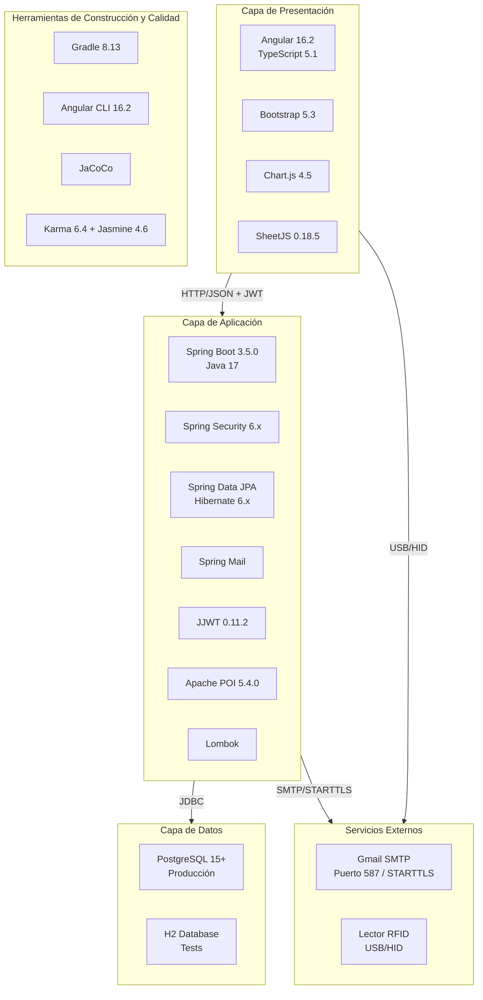
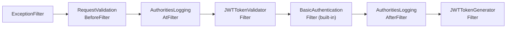
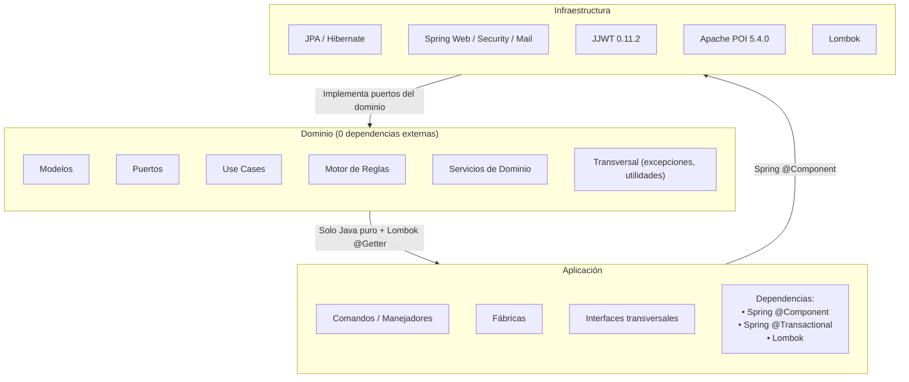
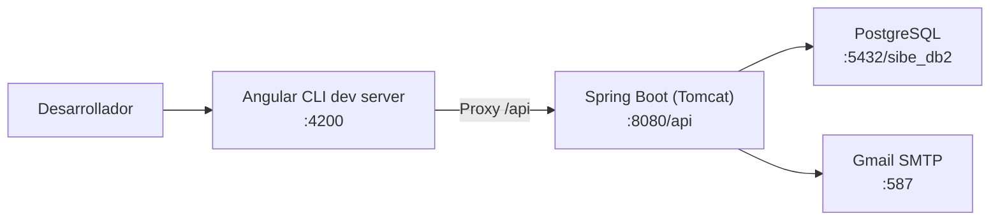
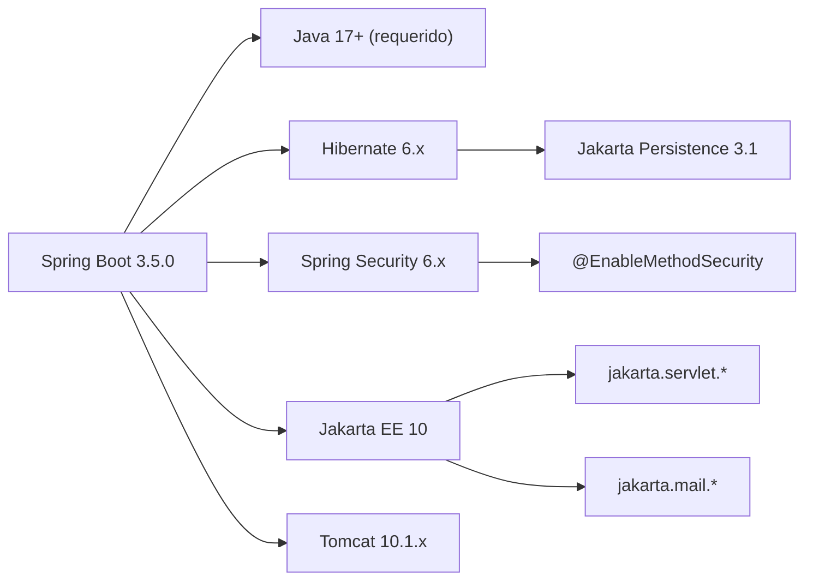

# 23. Stack Tecnológico

## 1. Propósito

Este documento detalla el stack tecnológico completo del sistema SIBE (Sistema de Información de Bienestar Estudiantil), incluyendo lenguajes, frameworks, bibliotecas, herramientas de construcción, dependencias de terceros, infraestructura de pruebas, y configuraciones de entorno. Cada tecnología está documentada con su versión exacta, propósito dentro del sistema, y justificación de su selección.

**Audiencia:** Desarrolladores, arquitectos, equipo de operaciones, auditores técnicos, nuevos miembros del equipo.

**Relación con otros artefactos:**
- **Artefacto 21 — Arquitectura de Referencia:** Describe las decisiones arquitectónicas que motivaron la selección del stack.
- **Artefacto 22 — Arquetipo de Solución:** Describe los patrones de implementación que utilizan estas tecnologías.
- **Artefacto 23 — Stack Tecnológico (este documento):** Cataloga exhaustivamente cada tecnología con versiones, configuraciones y justificaciones.

---

## 2. Visión General del Stack



---

## 3. Backend — Stack Detallado

### 3.1 Lenguaje y Runtime

| Tecnología | Versión | Configuración | Justificación |
|------------|---------|---------------|---------------|
| **Java** | 17 (LTS) | `JavaLanguageVersion.of(17)` en `build.gradle` | Long-Term Support, soporte de records, sealed classes, pattern matching, switch expressions. Versión mínima requerida por Spring Boot 3.x. |
| **JVM Target** | ES2022-compatible bytecode | Toolchain de Gradle | Compatibilidad con features modernas de Java 17 (text blocks, var, etc.) |

### 3.2 Framework Principal

| Tecnología | Versión | Artefacto Gradle | Justificación |
|------------|---------|------------------|---------------|
| **Spring Boot** | 3.5.0 | `org.springframework.boot` plugin | Framework de aplicación enterprise. Auto-configuración, servidor embebido Tomcat, inyección de dependencias. |
| **Spring Dependency Management** | 1.1.7 | `io.spring.dependency-management` plugin | Gestión centralizada de versiones transitivas de Spring. |

### 3.3 Módulos Spring

| Módulo | Artefacto | Versión | Propósito en SIBE |
|--------|-----------|---------|-------------------|
| **Spring Web** | `spring-boot-starter-web` | 3.5.0 (managed) | API REST, controladores `@RestController`, Tomcat embebido, serialización JSON (Jackson). |
| **Spring Data JPA** | `spring-boot-starter-data-jpa` | 3.5.0 (managed) | Persistencia ORM, `JpaRepository`, query methods derivados, gestión de transacciones `@Transactional`. |
| **Spring Security** | `spring-boot-starter-security` | 3.5.0 (managed) | Autenticación HTTP Basic, cadena de filtros, `@PreAuthorize`, `@EnableMethodSecurity`, `SecurityFilterChain`. |
| **Spring Mail** | `spring-boot-starter-mail` | 3.5.0 (managed) | Envío de correos con `JavaMailSender`, soporte MIME con `MimeMessageHelper`, envío asíncrono con `@Async`. |

### 3.4 Persistencia

| Tecnología | Versión | Artefacto | Propósito |
|------------|---------|-----------|-----------|
| **Hibernate ORM** | 6.x (managed por Spring Boot 3.5) | Transitiva vía `spring-boot-starter-data-jpa` | ORM para mapeo objeto-relacional. Dialecto: `PostgreSQLDialect`. DDL: `update` (auto-generación de esquema). |
| **PostgreSQL Driver** | Latest (managed) | `org.postgresql:postgresql` (runtimeOnly) | Driver JDBC para base de datos de producción. Puerto: 5432, BD: `sibe_db2`. |
| **H2 Database** | Latest (managed) | `com.h2database:h2` (runtimeOnly) | Base de datos en memoria para tests de integración. |
| **Jakarta Persistence API** | 3.1 (managed) | Transitiva vía Spring Data JPA | Anotaciones JPA: `@Entity`, `@Table`, `@Column`, `@OneToMany`, `@JoinTable`, `@JoinColumn`. |

**Configuración JPA relevante:**

```properties
spring.jpa.open-in-view=false          # Sin Open Session in View — consultas explícitas
spring.jpa.hibernate.ddl-auto=update   # Auto-generación de esquema en desarrollo
spring.jpa.properties.hibernate.dialect=org.hibernate.dialect.PostgreSQLDialect
```

### 3.5 Seguridad y Autenticación

| Tecnología | Versión | Artefacto | Propósito |
|------------|---------|-----------|-----------|
| **Spring Security** | 6.x (managed) | `spring-boot-starter-security` | Framework de seguridad: filter chain, autenticación Basic, autorización por roles. |
| **JJWT (Java JWT)** | 0.11.2 | `io.jsonwebtoken:jjwt-api`, `jjwt-impl`, `jjwt-jackson` | Generación y validación de tokens JWT. Algoritmo: HMAC-SHA256 (`Keys.hmacShaKeyFor()`). |
| **BCrypt** | Incluido en Spring Security | Transitiva | Hashing de contraseñas con `BCryptPasswordEncoder`. |

**Cadena de filtros de seguridad (orden de ejecución):**



**Detalles del JWT:**

| Parámetro | Valor |
|-----------|-------|
| Algoritmo de firma | HMAC-SHA256 |
| Biblioteca | JJWT 0.11.2 (`io.jsonwebtoken`) |
| Expiración | 30,000,000 ms (~8.33 horas) |
| Claims personalizados | `email`, `id`, `authorities`, `rol`, `direccionId`, `areaId`, `subareaId` |
| Header de respuesta | `Authorization` |
| Almacenamiento en cliente | `sessionStorage` |

### 3.6 Procesamiento de Archivos

| Tecnología | Versión | Artefacto | Propósito |
|------------|---------|-----------|-----------|
| **Apache POI** | 5.4.0 | `org.apache.poi:poi-ooxml` | Lectura y procesamiento de archivos Excel `.xlsx`. Clase principal: `ProcesadorExcelMotor` usando `XSSFWorkbook`. |

**Uso en SIBE:**
- Motor genérico `ProcesadorExcelMotor` que acepta un `FilaExcelMapeador<T>`.
- Lee la primera hoja del workbook, mapea columnas por nombre de encabezado.
- Implementaciones: `ProcesadorArchivoEstudianteServicioImplementacion` y `ProcesadorArchivoEmpleadoServicioImplementacion`.

### 3.7 Productividad del Desarrollador

| Tecnología | Versión | Artefacto | Propósito |
|------------|---------|-----------|-----------|
| **Lombok** | Latest (managed) | `org.projectlombok:lombok` (compileOnly + annotationProcessor) | Reducción de boilerplate: `@Getter`, `@Setter`, `@AllArgsConstructor`, `@NoArgsConstructor`, `@RequiredArgsConstructor`, `@Slf4j`. |

**Anotaciones Lombok usadas en el proyecto:**

| Anotación | Capa | Uso |
|-----------|------|-----|
| `@Getter` | Dominio (modelos) | Únicos accessors en modelos inmutables |
| `@Getter @Setter` | Dominio (DTOs), Infraestructura (entidades) | POJOs mutables |
| `@AllArgsConstructor` | Todas las capas | Constructor con todos los campos para Spring DI |
| `@NoArgsConstructor` | DTOs, Entidades, Comandos | Constructor vacío requerido por JPA/Jackson |
| `@RequiredArgsConstructor` | Infraestructura (DataLoaders) | Constructor solo para campos `final` |
| `@Slf4j` | Infraestructura | Logger SLF4J en `ProcesadorExcelMotor` |

### 3.8 Correo Electrónico

| Tecnología | Versión | Configuración | Propósito |
|------------|---------|---------------|-----------|
| **Spring Mail** | Managed por Spring Boot | `JavaMailSender` + `MimeMessageHelper` | Envío de correos OTP para recuperación de contraseña. |
| **Gmail SMTP** | N/A | Host: `smtp.gmail.com`, Puerto: 587, STARTTLS | Servidor SMTP externo. |

**Configuración:**

```properties
spring.mail.host=smtp.gmail.com
spring.mail.port=587
spring.mail.properties.mail.smtp.auth=true
spring.mail.properties.mail.smtp.starttls.enable=true
```

**Características de implementación:**
- Envío asíncrono con `@Async`.
- Plantilla HTML con logo embebido (`addInline`).
- Codificación UTF-8.

### 3.9 Herramienta de Construcción — Backend

| Tecnología | Versión | Archivo | Propósito |
|------------|---------|---------|-----------|
| **Gradle** | 8.13 | `gradle-wrapper.properties` | Build tool, gestión de dependencias, ejecución de tests y reportes. |
| **Gradle Wrapper** | 8.13 | `gradlew` / `gradlew.bat` | Ejecución reproducible sin instalación previa de Gradle. |

**Plugins Gradle:**

| Plugin | Versión | Propósito |
|--------|---------|-----------|
| `java` | Built-in | Compilación Java, toolchain |
| `org.springframework.boot` | 3.5.0 | Empaquetado como JAR ejecutable, `bootRun` |
| `io.spring.dependency-management` | 1.1.7 | BOM de versiones Spring |
| `jacoco` | Built-in | Cobertura de código |

**Tareas Gradle principales:**

```bash
./gradlew bootRun          # Ejecutar la aplicación
./gradlew test             # Ejecutar tests (JUnit Platform)
./gradlew jacocoTestReport # Generar reporte de cobertura (HTML, XML, CSV)
./gradlew build            # Compilar y empaquetar JAR
```

---

## 4. Frontend — Stack Detallado

### 4.1 Framework y Lenguaje

| Tecnología | Versión | Configuración | Justificación |
|------------|---------|---------------|---------------|
| **Angular** | 16.2.x | `@angular/core: ^16.2.0` | Framework SPA con sistema de módulos, inyección de dependencias, routing lazy-loaded, formularios reactivos. |
| **TypeScript** | 5.1.3 | `tsconfig.json`: target ES2022 | Tipado estático, interfaces para modelos, strict mode habilitado. |
| **Angular CLI** | 16.2.13 | `@angular/cli: ^16.2.13` | Scaffolding, build, serve, test. |
| **RxJS** | 7.8.x | `rxjs: ~7.8.0` | Programación reactiva: `Observable`, `BehaviorSubject`, operadores `pipe`, `map`, `switchMap`, `catchError`. |

**Configuración TypeScript:**

```json
{
  "strict": true,
  "noImplicitOverride": true,
  "noImplicitReturns": true,
  "noFallthroughCasesInSwitch": true,
  "target": "ES2022",
  "module": "ES2022",
  "moduleResolution": "node"
}
```

### 4.2 UI Framework y Estilos

| Tecnología | Versión | Propósito |
|------------|---------|-----------|
| **Bootstrap** | 5.3.6 | Framework CSS: grid system, componentes (modals, dropdowns, cards), utilities. |
| **Bootstrap Icons** | 1.13.1 | Iconografía SVG. |
| **SCSS** | Integrado en Angular CLI | Preprocesador CSS configurado como `inlineStyleLanguage` por defecto. |
| **Swiper** | 11.2.10 | Carruseles y sliders interactivos. CSS bundle incluido en `angular.json`. |

**Estilos globales cargados (`angular.json`):**

```json
"styles": [
  "node_modules/bootstrap/dist/css/bootstrap.min.css",
  "node_modules/bootstrap-icons/font/bootstrap-icons.css",
  "src/styles.scss",
  "node_modules/swiper/swiper-bundle.css"
]
```

### 4.3 Visualización de Datos

| Tecnología | Versión | Propósito |
|------------|---------|-----------|
| **Chart.js** | 4.5.0 | Gráficos de barras, doughnut y líneas para dashboards de analítica. |
| **chartjs-plugin-datalabels** | 2.2.0 | Etiquetas de datos en gráficos (valores numéricos sobre barras/segmentos). |

**Componentes que usan Chart.js:**
- `TotalParticipantsComponent` — Gráfico de participantes por estructura organizacional.
- `CompletedActivitiesComponent` — Gráfico de actividades finalizadas.
- `TotalParticipantsMonthsComponent` — Gráfico de participantes por mes.

### 4.4 Generación de Reportes (Cliente)

| Tecnología | Versión | Propósito |
|------------|---------|-----------|
| **SheetJS (xlsx)** | 0.18.5 | Generación de archivos Excel `.xlsx` directamente en el navegador sin roundtrip al backend. |

**Servicio:** `ExcelReportService` — genera informes por dirección, área o subárea con datos jerárquicos de actividades, ejecuciones y participantes.

### 4.5 Autenticación y Sesión

| Tecnología | Versión | Propósito |
|------------|---------|-----------|
| **jwt-decode** | 4.0.0 | Decodificación de JWT en el cliente para extraer claims (rol, email, areaId, etc.). |
| **ngx-cookie-service** | 16.1.0 | Gestión de cookies (usado por `TokenInterceptor`). |
| **sessionStorage** | API Web nativa | Almacenamiento del JWT y rehidratación de sesión al recargar la página. |

### 4.6 Utilidades

| Tecnología | Versión | Propósito |
|------------|---------|-----------|
| **tslib** | 2.8.1 | Runtime helpers de TypeScript (reduce tamaño de bundles con `importHelpers: true`). |
| **zone.js** | 0.13.x | Detección de cambios de Angular (zones). |

### 4.7 Herramienta de Construcción — Frontend

| Tecnología | Versión | Propósito |
|------------|---------|-----------|
| **Angular CLI** | 16.2.13 | Build, serve, test, scaffolding. |
| **@angular-devkit/build-angular** | 16.2.16 | Builder Webpack para compilación y optimización. |
| **webpack-bundle-analyzer** | (devDependency) | Análisis de tamaño de bundles (`npm run analyze`). |

**Scripts npm definidos:**

```json
{
  "start": "ng serve --proxy-config proxy.conf.json -o",
  "build": "ng build",
  "build:stats": "ng build --configuration production --stats-json",
  "analyze": "webpack-bundle-analyzer dist/app-base/stats.json",
  "test": "ng test --browsers=ChromeHeadless --watch=false --code-coverage"
}
```

**Configuración de proxy (desarrollo):**

```json
{
  "/api": {
    "target": "http://localhost:8080",
    "secure": false,
    "changeOrigin": true,
    "logLevel": "debug"
  }
}
```

**Presupuestos de tamaño (producción):**

| Tipo | Warning | Error |
|------|---------|-------|
| Bundle inicial | 500 KB | 1 MB |
| Estilo de componente | 2 KB | 4 KB |

---

## 5. Base de Datos

### 5.1 Motor de Base de Datos

| Tecnología | Versión | Entorno | Configuración |
|------------|---------|---------|---------------|
| **PostgreSQL** | 15+ | Desarrollo y Producción | Host: `localhost:5432`, BD: `sibe_db2`, Usuario: `postgres` |
| **H2 Database** | Latest (embebido) | Tests | Modo in-memory, auto-configurado por Spring Boot Test |

### 5.2 Gestión de Esquema

| Aspecto | Valor | Detalle |
|---------|-------|---------|
| Estrategia DDL | `hibernate.ddl-auto=update` | Hibernate genera/modifica esquema automáticamente. |
| Migraciones | No implementadas | Pendiente migración a Flyway o Liquibase para producción. |
| Dialecto | `PostgreSQLDialect` | Optimización de SQL para PostgreSQL. |
| Open-in-View | `false` | Sin lazy loading fuera de transacción — todas las consultas deben ser explícitas. |

### 5.3 Modelo de Datos — Resumen de Entidades

| Subdominio | Entidades JPA | Tablas |
|------------|---------------|--------|
| Usuarios y autenticación | `PersonaEntidad`, `IdentificacionEntidad`, `UsuarioEntidad`, `RolEntidad`, `TipoUsuarioEntidad`, `TipoIdentificacionEntidad` | 6+ |
| Estructura organizacional | `DireccionEntidad`, `AreaEntidad`, `SubareaEntidad`, `UsuarioOrganizacionEntidad` | 4+ (con join tables) |
| Comunidad universitaria | `EstudianteEntidad`, `EmpleadoEntidad`, `ExternoEntidad`, `CiudadResidenciaEntidad`, `RelacionLaboralEntidad`, `CentroCostosEntidad` | 6+ |
| Configuración estratégica | `IndicadorEntidad`, `TipoIndicadorEntidad`, `TemporalidadEntidad`, `ProyectoEntidad`, `AccionEntidad`, `PublicoInteresEntidad` | 6+ |
| Actividades y asistencia | `ActividadEntidad`, `EjecucionActividadEntidad`, `EstadoActividadEntidad`, `RegistroAsistenciaEntidad`, `ParticipanteEstudianteEntidad`, `ParticipanteEmpleadoEntidad`, `ParticipanteExternoEntidad` | 7+ (con join tables) |
| Recuperación de clave | `PeticionRecuperacionClaveEntidad` | 1 |
| **Total** | **~30 entidades** | **~35+ tablas** (incluyendo join tables) |

### 5.4 Estrategia de Identificadores

| Aspecto | Implementación |
|---------|----------------|
| Tipo de PK | `UUID` nativo de PostgreSQL |
| Generación | Aplicación (no JPA `@GeneratedValue`) |
| Utilitario | `UtilUUID.generar(Predicate<UUID>)` — loop anti-colisión verificando contra repositorio |
| Herencia JPA | `JOINED` strategy para jerarquía Persona → Estudiante/Empleado/Externo |

---

## 6. Infraestructura de Pruebas

### 6.1 Backend — Testing Stack

| Tecnología | Versión | Artefacto | Propósito |
|------------|---------|-----------|-----------|
| **JUnit 5 (Jupiter)** | Managed por Spring Boot | `spring-boot-starter-test` | Framework de pruebas unitarias e integración. Anotaciones: `@Test`, `@BeforeEach`, `@ExtendWith`. |
| **JUnit Platform Launcher** | Managed | `junit-platform-launcher` (testRuntimeOnly) | Runner para Gradle. Configurado con `useJUnitPlatform()`. |
| **Mockito** | Managed por Spring Boot | `spring-boot-starter-test` | Framework de mocking. Anotaciones: `@Mock`, `@ExtendWith(MockitoExtension.class)`, `when()`, `verify()`. |
| **Spring Security Test** | Managed | `spring-security-test` | Utilidades de testing para seguridad: `MockMvc` con contextos de seguridad. |
| **Spring MockMvc** | Managed | `spring-boot-starter-test` | Testing de controladores REST sin servidor HTTP. `MockMultipartFile` para testing de uploads. |
| **JaCoCo** | Built-in Gradle plugin | `jacoco` plugin | Cobertura de código. Reportes: HTML, XML, CSV. |

**Patrones de testing observados:**

```java
// Patrón estándar de test unitario
@ExtendWith(MockitoExtension.class)
class MiClaseTest {
    @Mock private DependenciaA mockA;
    @Mock private DependenciaB mockB;
    private MiClase sut; // System Under Test

    @BeforeEach
    void setUp() {
        sut = new MiClase(mockA, mockB);
    }

    @Test
    void deberiaHacerAlgoCuandoCondicion() {
        // Arrange
        when(mockA.metodo()).thenReturn(valor);
        // Act
        var resultado = sut.ejecutar();
        // Assert
        assertEquals(esperado, resultado);
        verify(mockB).otroMetodo();
    }
}
```

**Convención de nombres de test:** `deberia{Acción}Cuando{Condición}` (español).

**Configuración JaCoCo:**

```groovy
jacocoTestReport {
    dependsOn test
    reports {
        xml.required = true
        csv.required = true
        html.outputLocation = layout.buildDirectory.dir('jacocoHtml')
    }
}
```

Ruta del reporte HTML: `build/jacocoHtml/index.html`

### 6.2 Frontend — Testing Stack

| Tecnología | Versión | Propósito |
|------------|---------|-----------|
| **Jasmine** | 4.6.x | Framework de testing BDD. Funciones: `describe()`, `it()`, `expect()`, `beforeEach()`. |
| **Karma** | 6.4.x | Test runner para navegador. Configurado con ChromeHeadless. |
| **karma-chrome-launcher** | 3.2.x | Launcher para Chrome/ChromeHeadless. |
| **karma-coverage** | 2.2.x | Plugin de cobertura de código (Istanbul). |
| **karma-jasmine** | 5.1.x | Adaptador de Jasmine para Karma. |
| **karma-jasmine-html-reporter** | 2.1.x | Reporte HTML de resultados de tests. |

**Comando de ejecución:**

```bash
ng test --browsers=ChromeHeadless --watch=false --code-coverage
```

Ruta del reporte de cobertura: `coverage/sibe-frontend/`

---

## 7. Servicios Externos

### 7.1 Gmail SMTP

| Parámetro | Valor |
|-----------|-------|
| Host | `smtp.gmail.com` |
| Puerto | 587 |
| Protocolo | STARTTLS |
| Autenticación | App Password de Google |
| Uso | Envío de códigos OTP para recuperación de contraseña |
| Implementación | `JavaMailSender` + `MimeMessageHelper` con `@Async` |

### 7.2 Lector RFID

| Parámetro | Valor |
|-----------|-------|
| Interfaz | USB/HID (Human Interface Device) |
| Protocolo | Emulación de teclado (keystroke injection) |
| Integración | Campos de input en el frontend capturan el número de carnet como texto |
| Dependencia de software | Ninguna — funciona como dispositivo de entrada nativo del SO |

---

## 8. Mapa de Dependencias por Capa



| Capa | Dependencias directas |
|------|-----------------------|
| **Dominio** | Solo Java 17 estándar + Lombok `@Getter` |
| **Aplicación** | Dominio + Spring `@Component` + Spring `@Transactional` + Lombok |
| **Infraestructura** | Aplicación + Dominio + Spring Boot (Web, Security, Data JPA, Mail) + JJWT + Apache POI + PostgreSQL/H2 + Lombok |

---

## 9. Configuración de Entorno

### 9.1 Desarrollo Local



| Componente | Puerto | Comando |
|------------|--------|---------|
| Frontend (ng serve) | 4200 | `npm start` → `ng serve --proxy-config proxy.conf.json -o` |
| Backend (Spring Boot) | 8080 | `./gradlew bootRun` |
| PostgreSQL | 5432 | Servicio del sistema operativo |

### 9.2 Configuración del Proxy de Desarrollo

```json
{
  "/api": {
    "target": "http://localhost:8080",
    "secure": false,
    "changeOrigin": true,
    "logLevel": "debug"
  }
}
```

El proxy redirige todas las peticiones `/api/*` del frontend (puerto 4200) al backend (puerto 8080), eliminando problemas de CORS durante desarrollo.

### 9.3 Variables de Configuración

| Variable | Archivo | Valor Desarrollo | Acción Requerida para Producción |
|----------|---------|------------------|----------------------------------|
| `server.port` | `application.properties` | 8080 | Mantener o ajustar |
| `server.servlet.context-path` | `application.properties` | `/api` | Mantener |
| `spring.datasource.url` | `application.properties` | `jdbc:postgresql://localhost:5432/sibe_db2` | Externalizar a variable de entorno |
| `spring.datasource.password` | `application.properties` | Hardcoded | **Mover a variable de entorno o vault** |
| `spring.jpa.hibernate.ddl-auto` | `application.properties` | `update` | **Cambiar a `validate` + Flyway** |
| `spring.mail.password` | `application.properties` | Hardcoded (App Password) | **Mover a variable de entorno o vault** |
| JWT Secret Key | `SeguridadConstante.java` | Hardcoded | **Mover a variable de entorno o vault** |
| CORS Allowed Origin | `ProjectSecurityConfig.java` | `http://localhost:4200` | **Externalizar a variable de entorno** |
| `environment.endpoint` | `environment.ts` | `/api` | Crear `environment.prod.ts` con URL de producción |

---

## 10. Compatibilidad de Versiones

### 10.1 Matriz de Compatibilidad Backend



| Dependencia | Requiere | Incompatible con |
|-------------|----------|------------------|
| Spring Boot 3.5.0 | Java 17+ | Java 11 o inferior, javax.* packages |
| Hibernate 6.x | Jakarta Persistence 3.1 | JPA 2.x (javax.persistence.*) |
| JJWT 0.11.2 | Java 8+ | JJWT 0.12.x (API breaking changes) |
| Apache POI 5.4.0 | Java 8+ | POI 3.x (API breaking changes) |
| Lombok | Java 17+ (versión reciente) | Versiones anteriores a 1.18.30 con Java 21 |

### 10.2 Matriz de Compatibilidad Frontend

| Dependencia | Requiere | Incompatible con |
|-------------|----------|------------------|
| Angular 16.2 | TypeScript 5.0-5.1, Node.js 16-18 | TypeScript 5.2+, Node.js 20+ |
| Bootstrap 5.3 | Sin dependencias JS obligatorias | Bootstrap 4 (markup diferente) |
| Chart.js 4.5 | Tree-shakeable | Chart.js 2.x/3.x (API diferente) |
| SheetJS 0.18.5 | Navegador moderno | Formatos propietarios (.xlsb) |
| RxJS 7.8 | TypeScript 4.2+ | RxJS 6.x (imports diferentes) |

---

## 11. Resumen Consolidado

### 11.1 Tabla de Stack Completo

| Categoría | Tecnología | Versión | Licencia |
|-----------|-----------|---------|----------|
| **Lenguaje Backend** | Java | 17 (LTS) | GPL v2 + CE |
| **Lenguaje Frontend** | TypeScript | 5.1.3 | Apache 2.0 |
| **Framework Backend** | Spring Boot | 3.5.0 | Apache 2.0 |
| **Framework Frontend** | Angular | 16.2.x | MIT |
| **ORM** | Hibernate (via Spring Data JPA) | 6.x (managed) | LGPL 2.1 |
| **BD Producción** | PostgreSQL | 15+ | PostgreSQL License |
| **BD Tests** | H2 Database | Managed | MPL 2.0 / EPL 1.0 |
| **Seguridad** | Spring Security | 6.x (managed) | Apache 2.0 |
| **JWT** | JJWT | 0.11.2 | Apache 2.0 |
| **Excel Backend** | Apache POI | 5.4.0 | Apache 2.0 |
| **Excel Frontend** | SheetJS (xlsx) | 0.18.5 | Apache 2.0 |
| **UI Framework** | Bootstrap | 5.3.6 | MIT |
| **Iconos** | Bootstrap Icons | 1.13.1 | MIT |
| **Gráficos** | Chart.js | 4.5.0 | MIT |
| **Carrusel** | Swiper | 11.2.10 | MIT |
| **Correo** | Spring Mail + Gmail SMTP | Managed | Apache 2.0 |
| **Build Backend** | Gradle | 8.13 | Apache 2.0 |
| **Build Frontend** | Angular CLI | 16.2.13 | MIT |
| **Cobertura Backend** | JaCoCo | Built-in | EPL 2.0 |
| **Testing Backend** | JUnit 5 + Mockito | Managed | EPL 2.0 / MIT |
| **Testing Frontend** | Jasmine + Karma | 4.6 / 6.4 | MIT |
| **Reducción de Código** | Lombok | Managed | MIT |
| **Programación Reactiva** | RxJS | 7.8.x | Apache 2.0 |

### 11.2 Conteo de Dependencias

| Ámbito | Directas | Transitivas (estimado) |
|--------|:--------:|:----------------------:|
| Backend — `implementation` | 8 | ~120+ |
| Backend — `compileOnly` | 1 (Lombok) | 0 |
| Backend — `runtimeOnly` | 2 (PostgreSQL, H2) | ~5 |
| Backend — `testImplementation` | 2 | ~30+ |
| Frontend — `dependencies` | 13 | ~80+ |
| Frontend — `devDependencies` | 11 | ~200+ |