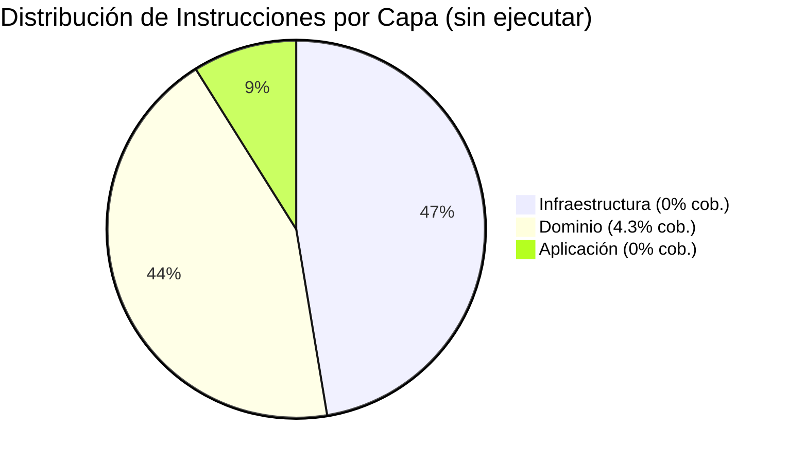
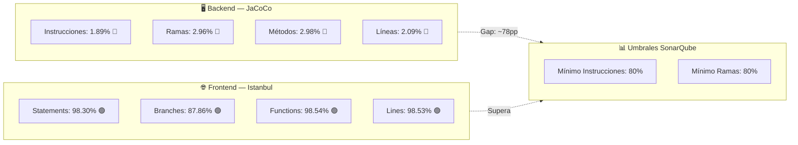

# Artefacto 34 — Cobertura de Código

| Campo             | Detalle                                      |
|-------------------|----------------------------------------------|
| **Proyecto**      | SIBE — Sistema de Información de Bienestar Estudiantil |
| **Tipo**          | Informe de Cobertura de Código               |
| **Herramientas**  | JaCoCo 0.8.x (Backend) · Istanbul / Karma 6.4 (Frontend) |
| **Versión**       | 1.0.0                                        |
| **Fecha**         | 2025-07-13                                   |
| **Autor**         | GitHub Copilot — Agente PO Método Ceiba      |
| **Referencias**   | Artefacto 32 (Pruebas Unitarias) · Artefacto 33 (Calidad de Código) |

---

## Tabla de Contenidos

- [Artefacto 34 — Cobertura de Código](#artefacto-34--cobertura-de-código)
  - [Tabla de Contenidos](#tabla-de-contenidos)
  - [Resumen Ejecutivo](#resumen-ejecutivo)
  - [Herramientas de Medición de Cobertura](#herramientas-de-medición-de-cobertura)
    - [2.1 Backend: JaCoCo](#21-backend-jacoco)
    - [2.2 Frontend: Karma + Istanbul](#22-frontend-karma--istanbul)
  - [Metodología de Medición](#metodología-de-medición)
    - [3.1 Métricas Medidas](#31-métricas-medidas)
      - [Backend (JaCoCo)](#backend-jacoco)
      - [Frontend (Istanbul)](#frontend-istanbul)
    - [3.2 Ejecución de Pruebas](#32-ejecución-de-pruebas)
    - [3.3 Umbrales de Calidad del Sector](#33-umbrales-de-calidad-del-sector)
  - [Cobertura Backend — JaCoCo](#cobertura-backend--jacoco)
    - [4.1 Resumen Global](#41-resumen-global)
    - [4.2 Análisis por Paquete](#42-análisis-por-paquete)
    - [4.3 Análisis por Capa Arquitectónica](#43-análisis-por-capa-arquitectónica)
    - [4.4 Clases con Cobertura Parcial](#44-clases-con-cobertura-parcial)
    - [4.5 Análisis de Causas Raíz](#45-análisis-de-causas-raíz)
  - [Cobertura Frontend — Istanbul](#cobertura-frontend--istanbul)
    - [5.1 Resumen Global](#51-resumen-global)
    - [5.2 Análisis por Módulo](#52-análisis-por-módulo)
      - [Core Layer](#core-layer)
      - [Feature: Login](#feature-login)
      - [Feature: Home (Componentes Comunes)](#feature-home-componentes-comunes)
      - [Feature: Manage Department](#feature-manage-department)
      - [Feature: Manage Indicators](#feature-manage-indicators)
      - [Feature: Manage Users](#feature-manage-users)
      - [Feature: Password Recovery](#feature-password-recovery)
      - [Shared Components](#shared-components)
    - [5.3 Áreas de Baja Cobertura de Ramas](#53-áreas-de-baja-cobertura-de-ramas)
  - [Comparativa Backend vs Frontend](#comparativa-backend-vs-frontend)
  - [Hotspots de Mejora](#hotspots-de-mejora)
    - [Backend — Alta Prioridad](#backend--alta-prioridad)
    - [Frontend — Prioridad Media](#frontend--prioridad-media)
  - [Plan de Acción](#plan-de-acción)
    - [Sprint 1 — Corrección estructural de pruebas backend (Semanas 1-2)](#sprint-1--corrección-estructural-de-pruebas-backend-semanas-1-2)
    - [Sprint 2 — Cobertura de domain use cases (Semanas 3-4)](#sprint-2--cobertura-de-domain-use-cases-semanas-3-4)
    - [Sprint 3 — Cobertura de infraestructura y frontend (Semanas 5-6)](#sprint-3--cobertura-de-infraestructura-y-frontend-semanas-5-6)
    - [Sprint 4 — Consolidación y Quality Gate (Semanas 7-8)](#sprint-4--consolidación-y-quality-gate-semanas-7-8)
  - [Historial de Cambios](#historial-de-cambios)

---

## Resumen Ejecutivo

El análisis de cobertura de código del sistema SIBE revela una **brecha crítica** entre la calidad del testing del backend Java y del frontend Angular.

| Componente  | Instrucciones / Sentencias | Ramas / Branches | Funciones | Líneas |
|-------------|---------------------------|------------------|-----------|--------|
| **Backend** | 1.89% (407 / 21 493) | 2.96% (33 / 1 113) | 2.98% (48 / 1 609) | 2.09% (105 / 5 019) |
| **Frontend** | 98.30% (4 229 / 4 302) | 87.86% (1 462 / 1 664) | 98.54% (1 082 / 1 098) | 98.53% (4 096 / 4 157) |

> **Veredicto Backend:** La cobertura del backend es críticamente baja (~2%). Aunque el proyecto cuenta con 96 clases de prueba documentadas en el Artefacto 32, el reporte JaCoCo confirma que el código de producción no se ejecuta durante las pruebas. La causa raíz identificada es el uso de objetos `@Mock` para las clases bajo prueba (en lugar de `@InjectMocks`), lo que impide que JaCoCo registre ejecución de código de producción. Toda la capa de aplicación y la capa de infraestructura tienen **0% de cobertura medida**.

> **Veredicto Frontend:** La cobertura del frontend es **excelente**, superando ampliamente los umbrales de la industria en sentencias (98.3%), funciones (98.5%) y líneas (98.5%). La única área de atención es la cobertura de ramas (87.86%), con siete módulos por debajo del 75%.

---

## Herramientas de Medición de Cobertura

### 2.1 Backend: JaCoCo

JaCoCo (Java Code Coverage) es la herramienta estándar de la industria para proyectos JVM. Está integrada como plugin de Gradle en el proyecto SIBE.

**Configuración en `build.gradle`:**

```groovy
// Plugin de JaCoCo integrado como capabilidad Gradle
plugins {
    id 'jacoco'
}

jacocoTestReport {
    reports {
        xml.required = true   // para integración CI/CD
        csv.required = true   // para análisis tabular
        html.required = true  // para revisión humana
    }
}

tasks.named('test') {
    useJUnitPlatform()
    finalizedBy jacocoTestReport  // genera reporte al finalizar pruebas
    ignoreFailures = true
}
```

**Rutas de reporte generadas:**

| Formato | Ruta                                                |
|---------|-----------------------------------------------------|
| HTML    | `SIBEBackend/build/jacocoHtml/index.html`           |
| XML     | `SIBEBackend/build/reports/jacoco/test/jacocoTestReport.xml` |
| CSV     | `SIBEBackend/build/reports/jacoco/test/jacocoTestReport.csv` |
| Exec    | `SIBEBackend/build/jacoco/test.exec`                |

**Alcance de medición:** JaCoCo instrumenta el bytecode de las clases compiladas en `src/main/java`. Las clases de prueba ubicadas en `src/test/java` no son instrumentadas (no forman parte del reporte). El archivo `.exec` es generado durante la ejecución de pruebas por el agente JaCoCo JVM.

**Paquetes medidos:** 32 paquetes · 462 clases · 21 493 instrucciones bytecode

### 2.2 Frontend: Karma + Istanbul

Karma 6.4 opera como test runner y delega la instrumentación de cobertura a Istanbul (nyc). La integración está configurada en `karma.conf.js` a través de la directiva `codeCoverage: true` del Angular CLI.

**Configuración de ejecución:**

```bash
ng test --browsers=ChromeHeadless --watch=false --code-coverage
```

**Rutas de reporte generadas:**

| Formato | Ruta                                                        |
|---------|-------------------------------------------------------------|
| HTML    | `SIBEFrontend/coverage/sibe-frontend/index.html`           |
| Per-file | `SIBEFrontend/coverage/sibe-frontend/app/**`               |

**Alcance de medición:** Istanbul instrumenta todos los archivos TypeScript compilados en `src/app/` y `src/environments/`. Mide cobertura a nivel de sentencias individuales, ramas condicionales, definiciones de función y líneas de código.

**Módulos medidos:** 59 rutas de directorios · Generado el 25 de marzo de 2026 a las 00:02:13 UTC

---

## Metodología de Medición

### 3.1 Métricas Medidas

#### Backend (JaCoCo)

| Métrica | Descripción | Fórmula |
|---------|-------------|---------|
| **Instrucciones (C0)** | Cobertura a nivel de bytecode JVM. Más granular que líneas de código | `instrucciones_cubiertas / instrucciones_totales` |
| **Ramas (C1)** | Cubre cada rama de decisión (`if/else`, `switch`, operador ternario) | `ramas_cubiertas / ramas_totales` |
| **Líneas** | Cuenta líneas de código fuente ejecutadas al menos una vez | `líneas_cubiertas / líneas_totales` |
| **Métodos** | Porcentaje de métodos/constructores invocados al menos una vez | `métodos_invocados / métodos_totales` |
| **Complejidad ciclomática** | Basada en el número de caminos linealmente independientes | `rutas_cubiertas / rutas_totales` |

#### Frontend (Istanbul)

| Métrica | Descripción |
|---------|-------------|
| **Statements (C0)** | Cada sentencia del AST de TypeScript transpilado ejecutada al menos una vez |
| **Branches (C1)** | Ramas de `if/else`, operador `?:`, `&&`, `||`, `switch`, expresión de desestructuración |
| **Functions** | Toda función, método, constructor y arrow function invocada |
| **Lines** | Líneas de código con sentencias ejecutadas |

### 3.2 Ejecución de Pruebas

**Backend — Comando de generación:**
```bash
.\gradlew test jacocoTestReport
```
Las pruebas utilizan JUnit 5 (Jupiter) con extensión Mockito. El agente JaCoCo se activa automáticamente via el plugin de Gradle. La opción `ignoreFailures = true` permite que el reporte se genere aunque algunas pruebas fallen.

**Frontend — Comando de generación:**
```bash
ng test --browsers=ChromeHeadless --watch=false --code-coverage
```
Las pruebas utilizan Jasmine 4.6 ejecutadas en Chrome headless. Istanbul instrumenta el código TypeScript transpilado por el compilador Angular.

### 3.3 Umbrales de Calidad del Sector

Los siguientes umbrales son utilizados como referencia de evaluación en este informe:

| Nivel | Instrucciones | Ramas | Descripción |
|-------|---------------|-------|-------------|
| **Excelente** | ≥ 90% | ≥ 85% | Cobertura de referencia para proyectos críticos |
| **Aceptable** | ≥ 80% | ≥ 70% | Umbral mínimo SonarQube por defecto (Quality Gate) |
| **Mínimo** | ≥ 70% | ≥ 60% | Umbral mínimo para proyectos con deuda técnica |
| **Insuficiente** | ≥ 50% | ≥ 40% | Cobertura parcial, requiere mejoras urgentes |
| **Crítico** | < 50% | < 40% | Cobertura no efectiva; riesgo de defectos no detectados |

---

## Cobertura Backend — JaCoCo

### 4.1 Resumen Global

El reporte JaCoCo fue generado sobre **462 clases de producción** distribuidas en **32 paquetes**. El siguiente cuadro presenta los totales globales del proyecto:

| Métrica | Cubiertos | Total | Perdidos | **Porcentaje** | Estado |
|---------|-----------|-------|----------|----------------|--------|
| **Instrucciones** | 407 | 21 493 | 21 086 | **1.89%** | 🔴 Crítico |
| **Ramas** | 33 | 1 113 | 1 080 | **2.96%** | 🔴 Crítico |
| **Líneas** | 105 | 5 019 | 4 914 | **2.09%** | 🔴 Crítico |
| **Métodos** | 48 | 1 609 | 1 561 | **2.98%** | 🔴 Crítico |
| **Complejidad** | 62 | 2 177 | 2 115 | **2.85%** | 🔴 Crítico |

> La cobertura global del backend se sitúa entorno al **2%**, lo que equivale a que prácticamente la totalidad del código de producción nunca es ejecutado por las pruebas automatizadas. Este resultado está a **~78 puntos porcentuales** por debajo del umbral mínimo aceptable de la industria (80%).

### 4.2 Análisis por Paquete

La siguiente tabla presenta los 32 paquetes del proyecto (prefijo `co.edu.uco.sibe` omitido por brevedad), ordenados de mayor a menor cobertura de instrucciones:

| Paquete | Instrucciones | Ramas | Estado |
|---------|--------------|-------|--------|
| `dominio.transversal.utilitarios` | **50.4%** (193/383) | **56.9%** (33/58) | 🟡 Insuficiente |
| `dominio.transversal.excepcion` | **33.3%** (12/36) | N/A (sin ramas) | 🔴 Crítico |
| `dominio.modelo` | **8.6%** (118/1 371) | N/A (sin ramas) | 🔴 Crítico |
| `dominio.regla.implementacion` | **5.0%** (84/1 683) | N/A (sin ramas) | 🔴 Crítico |
| `dominio.usecase.comando` | 0% (0/1 985) | 0% (0/160) | 🔴 Crítico |
| `infraestructura.adaptador.mapeador` | 0% (0/3 685) | 0% (0/128) | 🔴 Crítico |
| `dominio.regla.fabrica.implementacion` | 0% (0/1 976) | N/A (sin ramas) | 🔴 Crítico |
| `infraestructura.adaptador.repositorio.consulta` | 0% (0/2 721) | 0% (0/313) | 🔴 Crítico |
| `aplicacion.comando.fabrica` | 0% (0/1 001) | 0% (0/68) | 🔴 Crítico |
| `infraestructura.adaptador.repositorio.comando` | 0% (0/1 261) | 0% (0/96) | 🔴 Crítico |
| `dominio.usecase.consulta` | 0% (0/1 028) | 0% (0/100) | 🔴 Crítico |
| `aplicacion.comando.manejador` | 0% (0/496) | N/A (sin ramas) | 🔴 Crítico |
| `infraestructura.seguridad.filter` | 0% (0/432) | 0% (0/38) | 🔴 Crítico |
| `aplicacion.consulta` | 0% (0/412) | 0% (0/14) | 🔴 Crítico |
| `infraestructura.configuracion.bean` | 0% (0/467) | N/A (sin ramas) | 🔴 Crítico |
| `infraestructura.seguridad.configuration` | 0% (0/322) | 0% (0/20) | 🔴 Crítico |
| `infraestructura.adaptador.servicio` | 0% (0/295) | 0% (0/26) | 🔴 Crítico |
| `infraestructura.controlador.consulta` | 0% (0/195) | N/A (sin ramas) | 🔴 Crítico |
| `infraestructura.configuracion.dataloader` | 0% (0/202) | 0% (0/2) | 🔴 Crítico |
| `infraestructura.configuracion.dataloader.fabrica` | 0% (0/172) | N/A (sin ramas) | 🔴 Crítico |
| `infraestructura.adaptador.entidad` | 0% (0/164) | N/A (sin ramas) | 🔴 Crítico |
| `infraestructura.error` | 0% (0/140) | 0% (0/2) | 🔴 Crítico |
| `infraestructura.controlador.comando` | 0% (0/113) | N/A (sin ramas) | 🔴 Crítico |
| `dominio.service` | 0% (0/590) | 0% (0/86) | 🔴 Crítico |
| `dominio.transversal.constante` | 0% (0/126) | 0% (0/2) | 🔴 Crítico |
| `dominio.enums` | 0% (0/66) | N/A (sin ramas) | 🔴 Crítico |
| `dominio.regla.fabrica` | 0% (0/85) | N/A (sin ramas) | 🔴 Crítico |
| `dominio.regla` | 0% (0/27) | N/A (sin ramas) | 🔴 Crítico |
| `dominio.regla.motor` | 0% (0/39) | N/A (sin ramas) | 🔴 Crítico |
| `infraestructura.controlador` | 0% (0/6) | N/A (sin ramas) | 🔴 Crítico |
| `aplicacion.transversal` | 0% (0/6) | N/A (sin ramas) | 🔴 Crítico |
| `co.edu.uco.sibe` (raíz — main) | 0% (0/8) | N/A (sin ramas) | 🔴 Crítico |

> **Distribución:** Solo **4 de 32 paquetes** tienen cobertura medida mayor que 0%, y el mejor paquete (`dominio.transversal.utilitarios`) no alcanza el 60%.

### 4.3 Análisis por Capa Arquitectónica

El backend sigue una arquitectura hexagonal con tres capas principales. El impacto de la cobertura por capa es:



| Capa | Instrucciones Totales | Instrucciones Cubiertas | Cobertura | Estado |
|------|----------------------|------------------------|-----------|--------|
| **Dominio** | 9 395 | 407 | **4.33%** | 🔴 Crítico |
| **Aplicación** | 1 915 | 0 | **0.00%** | 🔴 Crítico |
| **Infraestructura** | 10 183 | 0 | **0.00%** | 🔴 Crítico |
| **Total Proyecto** | **21 493** | **407** | **1.89%** | 🔴 Crítico |

**Observaciones por capa:**

- **Capa Dominio (4.33%):** Es la única capa con algún grado de cobertura, concentrada en clases de utilidades de validación (`ValidadorTexto`, `ValidadorNumero`, `ValidadorObjeto`, `UtilUUID`), excepciones de dominio, y parcialmente en modelos y reglas concretas. Sin embargo, los casos de uso del dominio (`usecase.comando` y `usecase.consulta`) tienen 0% de cobertura a pesar de ser el núcleo de la lógica de negocio.

- **Capa Aplicación (0.00%):** Las fábricas de comandos (`aplicacion.comando.fabrica`), los manejadores de comandos (`aplicacion.comando.manejador`) y las consultas de aplicación (`aplicacion.consulta`) tienen **cero instrucciones cubiertas**. Estos son los 96 componentes que el Artefacto 32 identifica como sujetos de pruebas unitarias (`FabricaComandoXxxTest`, `ComandoManejaXxxTest`, `ConsultaXxxTest`).

- **Capa Infraestructura (0.00%):** Todos los adaptadores de repositorio, mapeadores, controladores REST, filtros de seguridad JWT y beans de configuración tienen cobertura cero.

### 4.4 Clases con Cobertura Parcial

Solo **13 clases** en todo el proyecto registran alguna ejecución durante las pruebas:

| Clase | Paquete | Instrucciones Perdidas | Observación |
|-------|---------|----------------------|-------------|
| `ValidadorTexto` | `dominio.transversal.utilitarios` | 97 restantes | Validación de texto más compleja |
| `ValidadorNumero` | `dominio.transversal.utilitarios` | 19 restantes | Parcialmente cubierta |
| `ValidadorObjeto` | `dominio.transversal.utilitarios` | 19 restantes | Parcialmente cubierta |
| `UtilUUID` | `dominio.transversal.utilitarios` | 17 restantes | Parcialmente cubierta |
| `Temporalidad` | `dominio.modelo` | 7 restantes | Modelo de valor cubierto parcialmente |
| `Indicador` | `dominio.modelo` | 12 restantes | Modelo de entidad cubierto parcialmente |
| `Proyecto` | `dominio.modelo` | 17 restantes | Modelo de entidad cubierto parcialmente |
| `TipoIndicador` | `dominio.modelo` | **0** (100% cubierta) | Único enum/modelo completamente cubierto |
| `TipoIndicadorRegla` | `dominio.regla.implementacion` | **0** (100% cubierta) | Regla de negocio completamente cubierta |
| `IndicadorRegla` | `dominio.regla.implementacion` | **0** (100% cubierta) | Regla de negocio completamente cubierta |
| `ValorObligatorioExcepcion` | `dominio.transversal.excepcion` | **0** (100% cubierta) | Excepción completamente cubierta |
| `PatronExcepcion` | `dominio.transversal.excepcion` | **0** (100% cubierta) | Excepción completamente cubierta |
| `LongitudExcepcion` | `dominio.transversal.excepcion` | **0** (100% cubierta) | Excepción completamente cubierta |

> De las 462 clases de producción, **449 (97.2%) no registran ningún tipo de cobertura** durante la ejecución del suite de pruebas. Solo 13 clases (2.8%) son alcanzadas indirectamente a través de dependencias de las clases de validación y modelo que sí son invocadas.

### 4.5 Análisis de Causas Raíz

La drástica diferencia entre la cantidad de pruebas documentadas y la cobertura medida apunta a un patrón sistémico en la forma en que están escritas las pruebas del backend.

**Causa principal identificada — Uso incorrecto de `@Mock` vs `@InjectMocks`:**

El patrón de pruebas en los 96 test classes del proyecto sigue esta estructura típica:

```java
// Patrón actual (NO genera cobertura)
@ExtendWith(MockitoExtension.class)
class FabricaComandoCrearActividadTest {

    @Mock
    private FabricaComandoCrearActividad fabrica;  // ← La clase bajo prueba es un Mock

    @Test
    void cuandoSeCreanParametrosValidos_retornaComando() {
        when(fabrica.crear("...")).thenReturn(...);  // ← Se invoca el mock, no el código real
        assertNotNull(fabrica.crear("..."));          // ← La clase real NUNCA se ejecuta
    }
}
```

```java
// Patrón correcto (genera cobertura)
@ExtendWith(MockitoExtension.class)
class FabricaComandoCrearActividadTest {

    @InjectMocks
    private FabricaComandoCrearActividad fabrica;  // ← Instancia real de la clase bajo prueba

    @Mock
    private DependenciaXxx dependencia;            // ← Solo las dependencias son mocks

    @Test
    void cuandoSeCreanParametrosValidos_retornaComando() {
        var resultado = fabrica.crear("...");        // ← El código real SÍ se ejecuta
        assertNotNull(resultado);
    }
}
```

**Evidencia del problema:**

- `aplicacion.comando.fabrica` (1 001 instrucciones): el Artefacto 32 lista 23 `FabricaComandoXxxTest` — pero la cobertura es **exactamente 0%**.
- `aplicacion.comando.manejador` (496 instrucciones): el Artefacto 32 lista 30 `ComandoManejaXxxTest` — pero la cobertura es **exactamente 0%**.
- `aplicacion.consulta` (412 instrucciones): el Artefacto 32 lista 43 `ConsultaXxxTest` — pero la cobertura es **exactamente 0%**.

**Causas secundarias posibles:**

| # | Causa | Probabilidad |
|---|-------|-------------|
| 1 | `@Mock` sobre la clase bajo prueba en lugar de `@InjectMocks` | Alta |
| 2 | Pruebas que solo verifican interacciones de mocks (`verify()`) sin el código real | Alta |
| 3 | `ignoreFailures = true` permite suite de pruebas que falla silenciosamente | Media |
| 4 | Clases no encontradas en classpath durante instrumentación JaCoCo | Baja |

---

## Cobertura Frontend — Istanbul

### 5.1 Resumen Global

El reporte Istanbul fue generado sobre **59 módulos** del proyecto Angular, analizando el código TypeScript transpilado. Los resultados son notablemente superiores a los estándares de la industria:

| Métrica | Cubiertos | Total | Sin cubrir | **Porcentaje** | Estado |
|---------|-----------|-------|-----------|----------------|--------|
| **Statements** | 4 229 | 4 302 | 73 | **98.30%** | 🟢 Excelente |
| **Branches** | 1 462 | 1 664 | 202 | **87.86%** | 🟢 Aceptable |
| **Functions** | 1 082 | 1 098 | 16 | **98.54%** | 🟢 Excelente |
| **Lines** | 4 096 | 4 157 | 61 | **98.53%** | 🟢 Excelente |

> El frontend supera ampliamente todos los umbrales de calidad de la industria excepto en cobertura de ramas (87.86%), que aun así cumple el umbral "Aceptable" de SonarQube (≥80%). La cobertura de sentencias, funciones y líneas es de **categoría Excelente**.

### 5.2 Análisis por Módulo

#### Core Layer

| Módulo | Stmt | Branches | Func | Lines |
|--------|------|----------|------|-------|
| `app` (raíz) | 100% (3/3) | 100% (0/0) | 100% (1/1) | 100% (2/2) |
| `core/components/footer` | 100% (2/2) | 100% (0/0) | 100% (0/0) | 100% (1/1) |
| `core/components/header` | 96% (72/75) | 93.1% (27/29) | 94.11% (16/17) | 96% (72/75) |
| `core/guard` | 98.07% (51/52) | 95.23% (20/21) | 100% (6/6) | 98.03% (50/51) |
| `core/interceptor` | 100% (72/72) | 100% (25/25) | 100% (15/15) | 100% (68/68) |
| `core/service` | 100% (37/37) | 83.33% (10/12) | 100% (16/16) | 100% (37/37) |

#### Feature: Login

| Módulo | Stmt | Branches | Func | Lines |
|--------|------|----------|------|-------|
| `feature/login/components` | 100% (22/22) | ⚠️ 53.84% (7/13) | 100% (7/7) | 100% (22/22) |
| `feature/login/service` | 100% (5/5) | 100% (0/0) | 100% (2/2) | 100% (5/5) |

#### Feature: Home (Componentes Comunes)

| Módulo | Stmt | Branches | Func | Lines |
|--------|------|----------|------|-------|
| `feature/home/components` | 100% (3/3) | 100% (0/0) | 100% (1/1) | 100% (3/3) |
| `feature/home/components/activities` | 100% (11/11) | 100% (1/1) | 100% (5/5) | 100% (11/11) |
| `feature/home/components/areas` | 100% (4/4) | 100% (0/0) | 100% (2/2) | 100% (3/3) |
| `feature/home/components/botton-data-container` | 100% (7/7) | 100% (0/0) | 100% (1/1) | 100% (7/7) |
| `feature/home/components/department-attendance-record` | 100% (2/2) | 100% (0/0) | 100% (0/0) | 100% (1/1) |
| `feature/home/components/home-filters` | 100% (3/3) | 100% (0/0) | 100% (2/2) | 100% (3/3) |
| `feature/home/components/home-primary-buttons` | 100% (15/15) | 100% (2/2) | 100% (5/5) | 100% (15/15) |
| `feature/home/components/principal-home` | 100% (2/2) | 100% (0/0) | 100% (0/0) | 100% (1/1) |
| ⚠️ `feature/home/components/top-data-container` | 95% (57/60) | ⚠️ 71.11% (32/45) | 90% (18/20) | 96.36% (53/55) |

> Las sub-áreas del módulo home (bienestar-area, evangelizacion-area, hogar-area, servicio-area) y sus respectivos sub-módulos (acompanamiento, banda, cancha, deportes, extension, gimnasio, trabajo-social, unidad) tienen en su totalidad **100%** en todos las métricas, con excepción del módulo `top-data-container` general.

#### Feature: Manage Department

| Módulo | Stmt | Branches | Func | Lines |
|--------|------|----------|------|-------|
| `feature/manage-department/components` | 100% (2/2) | 100% (0/0) | 100% (0/0) | 100% (1/1) |
| `feature/manage-department/components/area-statistics` | 100% (64/64) | 96.15% (25/26) | 100% (23/23) | 100% (64/64) |
| `feature/manage-department/components/bienestar-area` | 100% (4/4) | 100% (0/0) | 100% (1/1) | 100% (3/3) |
| `feature/manage-department/components/department` | 100% (3/3) | 100% (0/0) | 100% (4/4) | 100% (3/3) |
| `feature/manage-department/components/department-areas` | 100% (2/2) | 100% (0/0) | 100% (0/0) | 100% (1/1) |
| `feature/manage-department/components/evangelizacion-area` | 100% (4/4) | 100% (0/0) | 100% (1/1) | 100% (3/3) |
| `feature/manage-department/components/santa-maria-area` | 100% (4/4) | 100% (0/0) | 100% (1/1) | 100% (3/3) |
| `feature/manage-department/components/servicio-area` | 100% (4/4) | 100% (0/0) | 100% (1/1) | 100% (3/3) |

#### Feature: Manage Indicators

| Módulo | Stmt | Branches | Func | Lines |
|--------|------|----------|------|-------|
| `feature/manage-indicators/components` | 100% (2/2) | 100% (0/0) | 100% (0/0) | 100% (1/1) |
| `feature/manage-indicators/components/actions` | 100% (48/48) | 90% (9/10) | 100% (12/12) | 100% (47/47) |
| `feature/manage-indicators/components/edit-action` | 100% (48/48) | 100% (16/16) | 100% (10/10) | 100% (47/47) |
| `feature/manage-indicators/components/edit-indicator` | 100% (133/133) | 100% (37/37) | 100% (35/35) | 100% (129/129) |
| ⚠️ `feature/manage-indicators/components/edit-project` | 96.9% (94/97) | 90.9% (30/33) | 100% (26/26) | 97.82% (90/92) |
| `feature/manage-indicators/components/indicators` | 100% (44/44) | 88.88% (8/9) | 100% (11/11) | 100% (44/44) |
| `feature/manage-indicators/components/projects` | 100% (44/44) | 88.88% (8/9) | 100% (11/11) | 100% (44/44) |
| ⚠️ `feature/manage-indicators/components/register-new-action` | 91.11% (41/45) | ⚠️ 83.33% (15/18) | 85.71% (6/7) | 90.9% (40/44) |
| ⚠️ `feature/manage-indicators/components/register-new-indicator` | 96.8% (121/125) | ⚠️ 83.33% (30/36) | 100% (32/32) | 96.69% (117/121) |
| `feature/manage-indicators/components/register-new-project` | 100% (97/97) | 100% (36/36) | 100% (25/25) | 100% (93/93) |
| ⚠️ `feature/manage-indicators/service` | 97.5% (78/80) | 88.23% (15/17) | 100% (25/25) | 100% (77/77) |

#### Feature: Manage Users

| Módulo | Stmt | Branches | Func | Lines |
|--------|------|----------|------|-------|
| `feature/manage-users/components` | 100% (32/32) | 100% (1/1) | 100% (17/17) | 100% (29/29) |
| ⚠️ `feature/manage-users/components/area-users` | 99.09% (109/110) | 86.95% (20/23) | 100% (27/27) | 99.05% (105/106) |
| ⚠️ `feature/manage-users/components/department-users` | 97.08% (100/103) | ⚠️ 69.56% (16/23) | 100% (24/24) | 97% (97/100) |
| `feature/manage-users/components/edit-user` | 100% (168/168) | 88.15% (67/76) | 100% (35/35) | 100% (161/161) |
| `feature/manage-users/components/register-new-user` | 100% (122/122) | 97.29% (36/37) | 100% (28/28) | 100% (117/117) |
| `feature/manage-users/service` | 100% (11/11) | 100% (0/0) | 100% (4/4) | 100% (10/10) |

#### Feature: Password Recovery

| Módulo | Stmt | Branches | Func | Lines |
|--------|------|----------|------|-------|
| `feature/password-recovery/components` | 100% (93/93) | 93.75% (45/48) | 100% (16/16) | 100% (93/93) |
| `feature/password-recovery/service` | 100% (23/23) | 100% (0/0) | 100% (10/10) | 100% (20/20) |

#### Shared Components

| Módulo | Stmt | Branches | Func | Lines |
|--------|------|----------|------|-------|
| ⚠️ `shared/components/activities-table` | 97.83% (226/231) | 90.81% (89/98) | 97.61% (41/42) | 97.81% (224/229) |
| ⚠️ `shared/components/activity-info` | 98.7% (76/77) | 92.15% (47/51) | 100% (11/11) | 98.66% (74/75) |
| `shared/components/area-buttons` | 100% (25/25) | 100% (9/9) | 100% (6/6) | 100% (24/24) |
| `shared/components/area-top-image` | 100% (3/3) | 100% (0/0) | 100% (1/1) | 100% (3/3) |
| ⚠️ `shared/components/attendance-record` | 96.98% (290/299) | 86.5% (109/126) | 100% (55/55) | 96.98% (290/299) |
| ⚠️ `shared/components/change-password` | 88.88% (16/18) | 🔴 40% (2/5) | 100% (4/4) | 88.88% (16/18) |
| ⚠️ `shared/components/data-visualization/completed-activities` | 94.59% (35/37) | ⚠️ 69.44% (25/36) | 92.85% (13/14) | 94.59% (35/37) |
| ⚠️ `shared/components/data-visualization/total-participants` | 94.52% (69/73) | ⚠️ 64.44% (58/90) | 91.3% (21/23) | 94.52% (69/73) |
| ⚠️ `shared/components/data-visualization/total-participants-months` | 89.7% (61/68) | ⚠️ 66.07% (37/56) | 81.81% (18/22) | 90.62% (58/64) |
| ⚠️ `shared/components/date-selector` | 94.95% (113/119) | 80.48% (33/41) | 96% (24/25) | 94.87% (111/117) |
| `shared/components/edit-activity` | 100% (265/265) | 93.37% (141/151) | 100% (61/61) | 100% (258/258) |
| `shared/components/external-participant` | 100% (11/11) | 100% (3/3) | 100% (4/4) | 100% (11/11) |
| `shared/components/filter-list` | 100% (109/109) | 100% (74/74) | 100% (34/34) | 100% (108/108) |
| `shared/components/go-to-area-button` | 100% (3/3) | 100% (0/0) | 100% (1/1) | 100% (3/3) |
| `shared/components/pagination` | 100% (32/32) | 100% (9/9) | 100% (7/7) | 100% (26/26) |
| `shared/components/primary-button` | 100% (7/7) | 100% (3/3) | 100% (2/2) | 100% (7/7) |
| `shared/components/register-new-activity` | 100% (178/178) | 100% (76/76) | 100% (39/39) | 100% (173/173) |
| `shared/components/separator` | 100% (2/2) | 100% (0/0) | 100% (0/0) | 100% (1/1) |
| ⚠️ `shared/components/upload-database` | 96.33% (105/109) | 88.46% (46/52) | 100% (18/18) | 96.29% (104/108) |
| `shared/model` | 100% (10/10) | 100% (6/6) | 100% (3/3) | 100% (10/10) |
| ⚠️ `shared/service` | 97.58% (364/373) | 88.95% (145/163) | 97.11% (101/104) | 99.43% (355/357) |
| `environments` | 100% (1/1) | 100% (0/0) | 100% (0/0) | 100% (1/1) |

### 5.3 Áreas de Baja Cobertura de Ramas

Los siguientes módulos presentan la cobertura de ramas más baja y representan los focos de atención prioritarios:

| Prioridad | Módulo | Branch Coverage | Ramas sin cubrir | Severidad |
|-----------|--------|----------------|-----------------|-----------|
| 🔴 1 | `shared/components/change-password` | 40% (2/5) | 3 ramas | Crítico |
| 🟠 2 | `feature/login/components` | 53.84% (7/13) | 6 ramas | Alto |
| 🟠 3 | `data-visualization/total-participants` | 64.44% (58/90) | 32 ramas | Alto |
| 🟠 4 | `data-visualization/total-participants-months` | 66.07% (37/56) | 19 ramas | Alto |
| 🟡 5 | `data-visualization/completed-activities` | 69.44% (25/36) | 11 ramas | Medio |
| 🟡 6 | `manage-users/components/department-users` | 69.56% (16/23) | 7 ramas | Medio |
| 🟡 7 | `home/components/top-data-container` | 71.11% (32/45) | 13 ramas | Medio |
| 🟡 8 | `core/service` | 83.33% (10/12) | 2 ramas | Medio |
| 🟡 9 | `manage-indicators/register-new-action` | 83.33% (15/18) | 3 ramas | Medio |
| 🟡 10 | `manage-indicators/register-new-indicator` | 83.33% (30/36) | 6 ramas | Medio |

> **Nota sobre `change-password` (40%):** Este módulo gestiona el cambio de contraseña del usuario. La baja cobertura de ramas en un componente de seguridad es especialmente preocupante ya que ramas no validadas pueden ocultar comportamientos inseguros. Ver también Artefacto 33 — `auth-interceptor.ts` (CWE-312).

> **Nota sobre `data-visualization`:** Los componentes de visualización de datos concentran el mayor número de ramas no cubiertas (32 + 19 + 11 = 62 ramas). Esto sugiere que las pruebas no cubren los distintos estados condicionales de los gráficos (datos vacíos, carga, error, datos completos).

---

## Comparativa Backend vs Frontend

```mermaid
xychart-beta
    title "Cobertura de Código: Backend (JaCoCo) vs Frontend (Istanbul)"
    x-axis ["Instrucciones/Stmts", "Ramas/Branches", "Métodos/Funciones", "Líneas"]
    y-axis "Porcentaje (%)" 0 --> 100
    bar [1.89, 2.96, 2.98, 2.09]
    bar [98.30, 87.86, 98.54, 98.53]
```





**Resumen comparativo:**

| Métrica | Backend | Frontend | Delta | Umbral Mínimo | Backend Cumple | Frontend Cumple |
|---------|---------|----------|-------|---------------|----------------|-----------------|
| Instrucciones/Stmts | 1.89% | 98.30% | +96.41pp | 80% | ❌ No | ✅ Sí |
| Ramas/Branches | 2.96% | 87.86% | +84.90pp | 80% | ❌ No | ✅ Sí |
| Métodos/Funciones | 2.98% | 98.54% | +95.56pp | 80% | ❌ No | ✅ Sí |
| Líneas | 2.09% | 98.53% | +96.44pp | 80% | ❌ No | ✅ Sí |

> La brecha entre el backend (~2%) y el frontend (~98%) es de aproximadamente **96 puntos porcentuales**, una de las disparidades más extremas posibles. El frontend supera todos los umbrales; el backend no supera ninguno.

---

## Hotspots de Mejora

### Backend — Alta Prioridad

Los siguientes componentes deben ser abordados primero por su importancia arquitectónica y el volumen de código sin cubrir:

| # | Componente | Instrucciones sin cubrir | Impacto | Acción |
|---|-----------|------------------------|---------|--------|
| 1 | Toda la capa de Aplicación | 1 915 instrucciones (100%) | **Crítico** | Reescribir pruebas con `@InjectMocks` |
| 2 | `dominio.usecase.comando` | 1 985 instrucciones (100%) | **Crítico** | Agregar pruebas de casos de uso (lógica de negocio central) |
| 3 | `dominio.usecase.consulta` | 1 028 instrucciones (100%) | **Crítico** | Agregar pruebas de consultas de dominio |
| 4 | `infraestructura.adaptador.mapeador` | 3 685 instrucciones (100%) | **Alto** | Pruebas de mapeo entidad ↔ dominio |
| 5 | `dominio.service` | 590 instrucciones (100%) | **Alto** | Pruebas de servicios de dominio |
| 6 | `dominio.regla.fabrica.implementacion` | 1 976 instrucciones (100%) | **Alto** | Pruebas de fábricas de reglas |

### Frontend — Prioridad Media

| # | Componente | Ramas sin cubrir | Impacto | Acción |
|---|-----------|----------------|---------|--------|
| 1 | `shared/components/change-password` | 3 ramas (60% sin cubrir) | **Alto** (componente de seguridad) | Cubrir casos: contraseña inválida, contraseñas no coinciden, error de red |
| 2 | `feature/login/components` | 6 ramas (46% sin cubrir) | **Alto** | Cubrir: login fallido, credenciales vacías, error de conexión |
| 3 | `data-visualization/total-participants` | 32 ramas (35% sin cubrir) | **Medio** | Cubrir estados: sin datos, datos parciales, error de carga |
| 4 | `data-visualization/total-participants-months` | 19 ramas (33% sin cubrir) | **Medio** | Cubrir estados vacíos y de error |
| 5 | `data-visualization/completed-activities` | 11 ramas (30% sin cubrir) | **Medio** | Cubrir variaciones de datos en visualización |
| 6 | `manage-users/department-users` | 7 ramas (30% sin cubrir) | **Medio** | Cubrir casos de usuarios sin departamento, filtros vacíos |

---

## Plan de Acción

### Sprint 1 — Corrección estructural de pruebas backend (Semanas 1-2)

**Objetivo:** Conseguir al menos 60% de cobertura en la capa de aplicación.

1. **Auditar los 96 test classes existentes** para identificar cuáles usan `@Mock` sobre la clase bajo prueba en lugar de `@InjectMocks`.
2. **Refactorizar las fábricas de comandos** (23 clases): sustituir `@Mock FabricaComandoXxx` por `@InjectMocks FabricaComandoXxx` + mocks de dependencias.
3. **Refactorizar los manejadores de comandos** (30 clases): instanciar el manejador real con dependencias mockeadas.
4. **Refactorizar las consultas de aplicación** (43 clases): instanciar el servicio real; mockear puertos de salida.
5. **Verificar** que `./gradlew test jacocoTestReport` genera cobertura ≥ 60% en `aplicacion.*`.

**Meta de cobertura al final del Sprint 1:**

| Capa | Situación Actual | Meta Sprint 1 |
|------|-----------------|---------------|
| Aplicación | 0% | ≥ 60% |
| Dominio (utilitarios) | 50% | ≥ 75% |

### Sprint 2 — Cobertura de domain use cases (Semanas 3-4)

**Objetivo:** Añadir pruebas para los casos de uso del dominio.

1. Crear pruebas para `dominio.usecase.comando` (1 985 instrucciones sin cubrir).
2. Crear pruebas para `dominio.usecase.consulta` (1 028 instrucciones sin cubrir).
3. Crear pruebas para `dominio.service` (590 instrucciones sin cubrir).
4. Agregar pruebas de reglas de negocio en `dominio.regla.fabrica.implementacion`.

**Meta de cobertura al final del Sprint 2:**

| Capa | Meta Sprint 2 |
|------|---------------|
| Dominio | ≥ 50% |
| Global Backend | ≥ 30% |

### Sprint 3 — Cobertura de infraestructura y frontend (Semanas 5-6)

**Objetivo:** Cubrir mappers, repositorios y completar branches del frontend.

**Backend:**
1. Agregar pruebas de integración para repositorios JPA (`@DataJpaTest`).
2. Agregar pruebas de mapeadores entidad ↔ dominio.
3. Agregar pruebas de controladores REST (`@WebMvcTest`).

**Frontend:**
1. Añadir casos de prueba en `change-password` para ramas de error.
2. Añadir casos de prueba en `login/components` para credenciales inválidas.
3. Completar estados de carga/error en componentes `data-visualization`.

**Meta de cobertura al final del Sprint 3:**

| Componente | Meta Sprint 3 |
|------------|---------------|
| Backend Global | ≥ 60% instrucciones |
| Frontend Branches | ≥ 90% |

### Sprint 4 — Consolidación y Quality Gate (Semanas 7-8)

**Objetivo:** Alcanzar y mantener el Quality Gate de SonarQube.

1. Configurar SonarQube con Quality Gate: instrucciones ≥ 80%, ramas ≥ 80%.
2. Integrar análisis de cobertura en el pipeline CI/CD.
3. Establecer política de no-merge si la cobertura baja del umbral.
4. Documentar convenio de `@InjectMocks` en el archivo `coding-standards.md`.

**Meta final del plan:**

| Componente | Actual | Meta Final |
|------------|--------|------------|
| Backend — Instrucciones | 1.89% | ≥ 80% |
| Backend — Ramas | 2.96% | ≥ 70% |
| Frontend — Ramas | 87.86% | ≥ 92% |

---

## Historial de Cambios

| Versión | Fecha | Autor | Descripción |
|---------|-------|-------|-------------|
| 1.0.0 | 2025-07-13 | GitHub Copilot — Agente PO | Creación inicial del artefacto. Datos obtenidos de JaCoCo CSV (`jacocoTestReport.csv`, 463 líneas) e Istanbul HTML (`coverage/sibe-frontend/index.html`, generado 2026-03-25). Análisis de 462 clases backend y 59 módulos frontend. |
