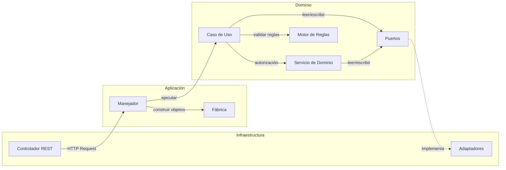

# Tarjetas CRC (Class-Responsibility-Collaborator) — SIBE

---

## 1. Descripción General

El presente documento describe las tarjetas CRC (Class-Responsibility-Collaborator) del sistema SIBE. Las tarjetas CRC son una técnica de diseño orientado a objetos que permite identificar, para cada clase del sistema:

- **Clase**: el nombre del componente.
- **Responsabilidades**: qué sabe (datos) y qué hace (comportamiento) la clase.
- **Colaboradores**: con qué otras clases interactúa para cumplir sus responsabilidades.

El sistema SIBE sigue una arquitectura hexagonal (puertos y adaptadores) con el patrón CQRS (Command-Query Responsibility Segregation). Las tarjetas se organizan por capa arquitectónica y subdominio.

### 1.1 Convenciones

| Símbolo | Significado |
| ------- | ----------- |
| **C** | Caso de uso de comando (escritura) |
| **Q** | Caso de uso de consulta (lectura) |
| **S** | Servicio de dominio |
| **F** | Fábrica (Factory) |
| **M** | Manejador (Handler) de la capa de aplicación |
| **P** | Puerto (interfaz) para adaptadores |
| **A** | Adaptador de infraestructura |
| **R** | Controlador REST (entry point) |

---

## 2. Capa de Dominio — Casos de Uso de Comando

### CRC-C01: LoginUseCase

| | LoginUseCase |
| - | ------------ |
| **Responsabilidades** | Validar que existe un usuario con el correo proporcionado. Retornar el identificador del usuario autenticado. |
| **Colaboradores** | PersonaRepositorioConsulta, EncriptarClaveServicio |

---

### CRC-C02: GuardarUsuarioUseCase

| | GuardarUsuarioUseCase |
| - | --------------------- |
| **Responsabilidades** | Validar autorización sobre la estructura organizacional destino. Ejecutar reglas de negocio sobre Usuario, Persona e Identificación. Validar unicidad de correo y documento. Encriptar contraseña. Persistir nuevo usuario con persona asociada. Vincular usuario con nivel organizacional (Dirección/Área/Subárea). |
| **Colaboradores** | PersonaRepositorioComando, PersonaRepositorioConsulta, EncriptarClaveServicio, VincularUsuarioConAreaService, AutorizacionContextoOrganizacionalServicio, MotoresFabrica |

---

### CRC-C03: ModificarUsuarioUseCase

| | ModificarUsuarioUseCase |
| - | ----------------------- |
| **Responsabilidades** | Validar autorización de acceso al usuario. Verificar existencia del usuario. Ejecutar reglas de negocio de actualización. Validar no duplicidad de correo y documento contra otros registros. Actualizar datos de usuario y persona. Actualizar vinculación organizacional si cambió. |
| **Colaboradores** | PersonaRepositorioComando, PersonaRepositorioConsulta, ModificarVinculacionUsuarioConAreaService, AutorizacionContextoOrganizacionalServicio, MotoresFabrica |

---

### CRC-C04: EliminarUsuarioUseCase

| | EliminarUsuarioUseCase |
| - | ---------------------- |
| **Responsabilidades** | Validar autorización de acceso al usuario. Verificar que el usuario existe. Eliminar o deshabilitar al usuario según si tiene actividades asociadas. |
| **Colaboradores** | PersonaRepositorioComando, PersonaRepositorioConsulta, AutorizacionContextoOrganizacionalServicio |

---

### CRC-C05: ModificarClaveUseCase

| | ModificarClaveUseCase |
| - | --------------------- |
| **Responsabilidades** | Validar autorización del usuario autenticado. Verificar existencia del usuario. Validar que la nueva contraseña sea diferente a la actual. Verificar que la contraseña antigua sea correcta (comparación BCrypt). Encriptar y persistir la nueva contraseña. |
| **Colaboradores** | PersonaRepositorioComando, PersonaRepositorioConsulta, EncriptarClaveServicio, AutorizacionContextoOrganizacionalServicio, MotoresFabrica |

---

### CRC-C06: SolicitarCodigoUseCase

| | SolicitarCodigoUseCase |
| - | ---------------------- |
| **Responsabilidades** | Validar que existe un usuario con el correo indicado. Generar código aleatorio de 6 caracteres. Cifrar el código con BCrypt. Enviar correo electrónico con plantilla HTML institucional. Persistir petición de recuperación con código cifrado y marca temporal. |
| **Colaboradores** | PersonaRepositorioConsulta, PersonaRepositorioComando, EncriptarClaveServicio, EnviarCorreoElectronicoService |

---

### CRC-C07: ValidarCodigoRecuperacionClaveUseCase

| | ValidarCodigoRecuperacionClaveUseCase |
| - | ------------------------------------- |
| **Responsabilidades** | Verificar que el código ingresado coincide con el cifrado almacenado (BCrypt). Validar que no han transcurrido más de 5 minutos desde la generación. Eliminar la petición de recuperación tras validación exitosa. |
| **Colaboradores** | PersonaRepositorioConsulta, PersonaRepositorioComando, EncriptarClaveServicio |

---

### CRC-C08: RecuperarClaveUseCase

| | RecuperarClaveUseCase |
| - | --------------------- |
| **Responsabilidades** | Validar que existe el usuario con el correo. Ejecutar reglas de negocio sobre la nueva contraseña. Encriptar y persistir la nueva contraseña. |
| **Colaboradores** | PersonaRepositorioComando, PersonaRepositorioConsulta, EncriptarClaveServicio, MotoresFabrica |

---

### CRC-C09: GuardarActividadUseCase

| | GuardarActividadUseCase |
| - | ----------------------- |
| **Responsabilidades** | Validar autorización sobre la estructura organizacional destino (Dirección/Área/Subárea). Ejecutar reglas de negocio sobre la actividad. Validar unicidad de nombre en el semestre dentro de la estructura. Persistir actividad. Vincular con nivel organizacional. Por cada fecha programada: validar reglas de ejecución, validar que la fecha no sea anterior a hoy, validar pertenencia al semestre, crear ejecución con estado "Pendiente". |
| **Colaboradores** | ActividadRepositorioComando, ActividadRepositorioConsulta, VincularActividadConAreaService, AutorizacionContextoOrganizacionalServicio, MotoresFabrica |

---

### CRC-C10: ModificarActividadUseCase

| | ModificarActividadUseCase |
| - | ------------------------- |
| **Responsabilidades** | Validar autorización sobre la actividad y la estructura organizacional. Verificar existencia de la actividad. Ejecutar reglas de negocio de actualización. Validar unicidad de nombre excluyendo la propia. Actualizar datos de actividad. Actualizar vinculación organizacional. Por cada ejecución pendiente con fecha modificada: validar fecha futura y pertenencia al semestre. Persistir ejecuciones actualizadas. |
| **Colaboradores** | ActividadRepositorioComando, ActividadRepositorioConsulta, ModificarVinculacionActividadConAreaService, AutorizacionContextoOrganizacionalServicio, MotoresFabrica |

---

### CRC-C11: IniciarActividadUseCase

| | IniciarActividadUseCase |
| - | ----------------------- |
| **Responsabilidades** | Validar autorización de acceso a la ejecución. Verificar que la ejecución existe. Validar que el estado sea "Pendiente". Obtener estado "En Curso" del repositorio. Registrar hora de inicio. Actualizar estado de la ejecución. |
| **Colaboradores** | ActividadRepositorioComando, ActividadRepositorioConsulta, EstadoActividadRepositorioConsulta, AutorizacionContextoOrganizacionalServicio |

---

### CRC-C12: FinalizarActividadUseCase

| | FinalizarActividadUseCase |
| - | ------------------------- |
| **Responsabilidades** | Validar autorización de acceso a la ejecución. Verificar que la ejecución existe y está "En Curso". Obtener estado "Finalizada". Registrar fecha de realización y hora de fin. Actualizar estado a "Finalizada". Para cada participante: crear o recuperar snapshot del participante (upsert). Crear registro de asistencia vinculando participante con ejecución. |
| **Colaboradores** | ActividadRepositorioComando, ActividadRepositorioConsulta, EstadoActividadRepositorioConsulta, RegistrarParticipanteService, RegistroAsistenciaRepositorioComando, RegistroAsistenciaRepositorioConsulta, AutorizacionContextoOrganizacionalServicio |

---

### CRC-C13: CancelarActividadUseCase

| | CancelarActividadUseCase |
| - | ------------------------ |
| **Responsabilidades** | Validar autorización de acceso a la ejecución. Verificar que la ejecución existe y está "En Curso". Obtener estado "Pendiente". Restaurar estado de la ejecución a "Pendiente" (los participantes temporales se descartan). |
| **Colaboradores** | ActividadRepositorioComando, ActividadRepositorioConsulta, EstadoActividadRepositorioConsulta, AutorizacionContextoOrganizacionalServicio |

---

### CRC-C14: GuardarIndicadorUseCase

| | GuardarIndicadorUseCase |
| - | ----------------------- |
| **Responsabilidades** | Ejecutar reglas de negocio sobre el indicador. Validar unicidad del nombre. Persistir indicador con sus relaciones (TipoIndicador, Temporalidad, PublicoInteres, Proyecto). |
| **Colaboradores** | IndicadorRepositorioComando, IndicadorRepositorioConsulta, MotoresFabrica |

---

### CRC-C15: ModificarIndicadorUseCase

| | ModificarIndicadorUseCase |
| - | ------------------------- |
| **Responsabilidades** | Ejecutar reglas de negocio de actualización. Verificar existencia del indicador. Validar unicidad del nombre excluyendo el propio. Persistir cambios. |
| **Colaboradores** | IndicadorRepositorioComando, IndicadorRepositorioConsulta, MotoresFabrica |

---

### CRC-C16: GuardarProyectoUseCase

| | GuardarProyectoUseCase |
| - | ---------------------- |
| **Responsabilidades** | Ejecutar reglas de negocio sobre el proyecto. Validar unicidad del número de proyecto. Persistir proyecto con sus acciones. |
| **Colaboradores** | ProyectoRepositorioComando, ProyectoRepositorioConsulta, MotoresFabrica |

---

### CRC-C17: ModificarProyectoUseCase

| | ModificarProyectoUseCase |
| - | ------------------------ |
| **Responsabilidades** | Verificar existencia del proyecto. Ejecutar reglas de negocio de actualización. Validar unicidad del número de proyecto excluyendo el propio. Persistir cambios. |
| **Colaboradores** | ProyectoRepositorioComando, ProyectoRepositorioConsulta, MotoresFabrica |

---

### CRC-C18: GuardarAccionUseCase

| | GuardarAccionUseCase |
| - | -------------------- |
| **Responsabilidades** | Ejecutar reglas de negocio sobre la acción. Validar unicidad del detalle. Persistir acción vinculada a un proyecto. |
| **Colaboradores** | AccionRepositorioComando, AccionRepositorioConsulta, MotoresFabrica |

---

### CRC-C19: ModificarAccionUseCase

| | ModificarAccionUseCase |
| - | ---------------------- |
| **Responsabilidades** | Ejecutar reglas de negocio de actualización. Validar unicidad del detalle excluyendo la propia. Persistir cambios. |
| **Colaboradores** | AccionRepositorioComando, AccionRepositorioConsulta, MotoresFabrica |

---

### CRC-C20: CargarMasivamenteEstudiantesUseCase

| | CargarMasivamenteEstudiantesUseCase |
| - | ----------------------------------- |
| **Responsabilidades** | Ejecutar reglas de negocio sobre CiudadResidencia y Estudiante. Buscar estudiante existente por número de identificación. Si existe: actualizar datos (upsert). Si no existe: crear nuevo registro. |
| **Colaboradores** | EstudianteRepositorioComando, EstudianteRepositorioConsulta, MotoresFabrica |

---

### CRC-C21: CargarMasivamenteEmpleadosUseCase

| | CargarMasivamenteEmpleadosUseCase |
| - | --------------------------------- |
| **Responsabilidades** | Ejecutar reglas de negocio sobre CiudadResidencia, RelacionLaboral, CentroCostos y Empleado. Buscar empleado existente por número de identificación. Si existe: actualizar datos (upsert). Si no existe: crear nuevo registro. |
| **Colaboradores** | EmpleadoRepositorioComando, EmpleadoRepositorioConsulta, MotoresFabrica |

---

### CRC-C22: GuardarDireccionUseCase

| | GuardarDireccionUseCase |
| - | ----------------------- |
| **Responsabilidades** | Ejecutar reglas de negocio. Validar unicidad del nombre. Persistir dirección con sus áreas. |
| **Colaboradores** | DireccionRepositorioComando, DireccionRepositorioConsulta, MotoresFabrica |

---

### CRC-C23: GuardarAreaUseCase

| | GuardarAreaUseCase |
| - | ------------------ |
| **Responsabilidades** | Ejecutar reglas de negocio. Validar unicidad del nombre. Persistir área con sus subáreas. |
| **Colaboradores** | AreaRepositorioComando, AreaRepositorioConsulta, MotoresFabrica |

---

## 3. Capa de Dominio — Casos de Uso de Consulta

### CRC-Q01: ConsultarUsuariosUseCase

| | ConsultarUsuariosUseCase |
| - | ------------------------ |
| **Responsabilidades** | Consultar todos los usuarios DTO. Filtrar por contexto organizacional: Administrador de Dirección ve todos; Administrador de Área ve solo los de su área y subáreas. |
| **Colaboradores** | PersonaRepositorioConsulta, AutorizacionContextoOrganizacionalServicio, AreaRepositorioConsulta |

---

### CRC-Q02: ConsultarUsuarioPorIdentificadorUseCase

| | ConsultarUsuarioPorIdentificadorUseCase |
| - | --------------------------------------- |
| **Responsabilidades** | Validar autorización sobre el usuario. Verificar existencia. Retornar DTO del usuario. |
| **Colaboradores** | PersonaRepositorioConsulta, AutorizacionContextoOrganizacionalServicio |

---

### CRC-Q03: ConsultarUsuarioPorCorreoUseCase

| | ConsultarUsuarioPorCorreoUseCase |
| - | -------------------------------- |
| **Responsabilidades** | Validar que el usuario existe con el correo indicado. Retornar DTO del usuario. |
| **Colaboradores** | PersonaRepositorioConsulta |

---

### CRC-Q04: ConsultarActividadesPorDireccionUseCase

| | ConsultarActividadesPorDireccionUseCase |
| - | --------------------------------------- |
| **Responsabilidades** | Validar autorización de acceso a la dirección. Verificar existencia de la dirección. Consultar y retornar actividades asignadas a la dirección. |
| **Colaboradores** | ActividadRepositorioConsulta, DireccionRepositorioConsulta, AutorizacionContextoOrganizacionalServicio |

---

### CRC-Q05: ConsultarActividadesPorAreaUseCase

| | ConsultarActividadesPorAreaUseCase |
| - | ---------------------------------- |
| **Responsabilidades** | Validar autorización de acceso al área. Verificar existencia del área. Consultar y retornar actividades asignadas al área. |
| **Colaboradores** | ActividadRepositorioConsulta, AreaRepositorioConsulta, AutorizacionContextoOrganizacionalServicio |

---

### CRC-Q06: ConsultarActividadesPorSubareaUseCase

| | ConsultarActividadesPorSubareaUseCase |
| - | ------------------------------------- |
| **Responsabilidades** | Validar autorización de acceso a la subárea. Verificar existencia de la subárea. Consultar y retornar actividades asignadas a la subárea. |
| **Colaboradores** | ActividadRepositorioConsulta, SubareaRepositorioConsulta, AutorizacionContextoOrganizacionalServicio |

---

### CRC-Q07: ConsultarEjecucionesPorActividadUseCase

| | ConsultarEjecucionesPorActividadUseCase |
| - | --------------------------------------- |
| **Responsabilidades** | Validar autorización de acceso a la actividad. Verificar existencia. Consultar y retornar ejecuciones (fechas programadas) con sus estados. |
| **Colaboradores** | ActividadRepositorioConsulta, AutorizacionContextoOrganizacionalServicio |

---

### CRC-Q08: ConsultarParticipantesPorEjecucionActividadUseCase

| | ConsultarParticipantesPorEjecucionActividadUseCase |
| - | -------------------------------------------------- |
| **Responsabilidades** | Validar autorización de acceso a la ejecución. Verificar que la ejecución existe. Consultar y retornar participantes registrados en esa ejecución. |
| **Colaboradores** | ActividadRepositorioConsulta, AutorizacionContextoOrganizacionalServicio |

---

### CRC-Q09: ConsultarMiembroPorIdentificacionUseCase

| | ConsultarMiembroPorIdentificacionUseCase |
| - | ---------------------------------------- |
| **Responsabilidades** | Buscar miembro por número de identificación. Validar que existe. Retornar DTO del miembro (estudiante o empleado). |
| **Colaboradores** | MiembroRepositorioConsulta |

---

### CRC-Q10: ConsultarMiembroPorIdCarnetUseCase

| | ConsultarMiembroPorIdCarnetUseCase |
| - | ---------------------------------- |
| **Responsabilidades** | Buscar miembro por ID de carnet RFID. Validar que existe. Retornar DTO del miembro. |
| **Colaboradores** | MiembroRepositorioConsulta |

---

### CRC-Q11: ConsultarDireccionDetalladaUseCase

| | ConsultarDireccionDetalladaUseCase |
| - | ---------------------------------- |
| **Responsabilidades** | Validar autorización de acceso a la dirección. Consultar detalle completo (áreas y subáreas incluidas). |
| **Colaboradores** | DireccionRepositorioConsulta, AutorizacionContextoOrganizacionalServicio |

---

### CRC-Q12: ConsultarAreaDetalladaUseCase

| | ConsultarAreaDetalladaUseCase |
| - | ----------------------------- |
| **Responsabilidades** | Validar autorización de acceso al área. Consultar detalle completo del área (subáreas incluidas). |
| **Colaboradores** | AreaRepositorioConsulta, AutorizacionContextoOrganizacionalServicio |

---

### CRC-Q13: ConsultarEstadisticasParticipantesPorMesUseCase

| | ConsultarEstadisticasParticipantesPorMesUseCase |
| - | ----------------------------------------------- |
| **Responsabilidades** | Validar autorización según filtro de estructura organizacional. Consultar estadísticas de participantes agrupadas por mes, aplicando filtros dinámicos (año, semestre, programa, etc.). |
| **Colaboradores** | ActividadRepositorioConsulta, AutorizacionContextoOrganizacionalServicio |

---

### CRC-Q14: ContarParticipantesTotalesUseCase / ContarAsistenciasTotalesUseCase / ContarEjecucionesTotalesUseCase / ContarPoblacionTotalUseCase

| | Casos de uso de conteo |
| - | ---------------------- |
| **Responsabilidades** | Validar autorización según filtro. Consultar conteos totales (participantes únicos, asistencias, ejecuciones finalizadas, población total) según filtros aplicados. |
| **Colaboradores** | ActividadRepositorioConsulta, AutorizacionContextoOrganizacionalServicio |

---

## 4. Capa de Dominio — Servicios de Dominio

### CRC-S01: AutorizacionContextoOrganizacionalServicio

| | AutorizacionContextoOrganizacionalServicio |
| - | ------------------------------------------ |
| **Responsabilidades** | Obtener el contexto del usuario autenticado (rol, direcciónId, áreaId, subáreaId) desde el token JWT. Validar acceso a Dirección: solo Administrador de Dirección. Validar acceso a Área: Administrador de Dirección o Administrador de Área con áreaId coincidente. Validar acceso a Subárea: verificar que la subárea pertenezca al área del usuario. Validar acceso a actividades, ejecuciones y usuarios según su vinculación organizacional. |
| **Colaboradores** | ContextoUsuarioProveedorServicio, AreaRepositorioConsulta, SubareaRepositorioConsulta, ActividadRepositorioConsulta, UsuarioOrganizacionRepositorioConsulta |

---

### CRC-S02: VincularUsuarioConAreaService

| | VincularUsuarioConAreaService |
| - | ----------------------------- |
| **Responsabilidades** | Vincular un usuario con un nivel organizacional (Dirección, Área o Subárea) según el TipoArea proporcionado. |
| **Colaboradores** | UsuarioOrganizacionComando |

---

### CRC-S03: ModificarVinculacionUsuarioConAreaService

| | ModificarVinculacionUsuarioConAreaService |
| - | ----------------------------------------- |
| **Responsabilidades** | Cambiar la vinculación organizacional de un usuario existente, reasignándolo a un nuevo nivel según TipoArea. |
| **Colaboradores** | UsuarioOrganizacionComando |

---

### CRC-S04: VincularActividadConAreaService

| | VincularActividadConAreaService |
| - | ------------------------------- |
| **Responsabilidades** | Vincular una actividad con un nivel organizacional (Dirección, Área o Subárea) mediante el repositorio correspondiente. |
| **Colaboradores** | DireccionRepositorioComando, AreaRepositorioComando, SubareaRepositorioComando |

---

### CRC-S05: ModificarVinculacionActividadConAreaService

| | ModificarVinculacionActividadConAreaService |
| - | ------------------------------------------- |
| **Responsabilidades** | Buscar la vinculación organizacional actual de una actividad. Desvincular del nivel anterior. Vincular al nuevo nivel organizacional. |
| **Colaboradores** | DireccionRepositorioComando, AreaRepositorioComando, SubareaRepositorioComando, DireccionRepositorioConsulta, AreaRepositorioConsulta, SubareaRepositorioConsulta, VincularActividadConAreaService |

---

### CRC-S06: RegistrarParticipanteService

| | RegistrarParticipanteService |
| - | ---------------------------- |
| **Responsabilidades** | Buscar si ya existe un participante (snapshot) para el miembro por número de documento. Si existe, retornar el existente. Si no existe, crear y persistir nuevo participante (snapshot). |
| **Colaboradores** | ParticipanteRepositorioConsulta, ParticipanteRepositorioComando |

---

### CRC-S07: ContarUsuariosPorOrganizacionService

| | ContarUsuariosPorOrganizacionService |
| - | ------------------------------------ |
| **Responsabilidades** | Validar autorización. Contar usuarios vinculados a una Dirección (incluye recursivamente todas sus áreas y subáreas), un Área (incluye sus subáreas) o una Subárea. |
| **Colaboradores** | UsuarioOrganizacionRepositorioConsulta, AutorizacionContextoOrganizacionalServicio |

---

## 5. Capa de Aplicación — Manejadores (Handlers)

### 5.1 Manejadores de Comando

| Tarjeta | Clase | Responsabilidades | Colaboradores |
| ------- | ----- | ----------------- | ------------- |
| CRC-M01 | GuardarUsuarioManejador | Construir objetos de dominio (Usuario, Persona) desde el comando. Extraer área y tipo. Delegar al caso de uso. | UsuarioFabrica, PersonaFabrica, GuardarUsuarioUseCase |
| CRC-M02 | ModificarUsuarioManejador | Construir objetos de dominio actualizados desde el comando. Delegar al caso de uso con el identificador. | UsuarioFabrica, PersonaFabrica, ModificarUsuarioUseCase |
| CRC-M03 | EliminarPersonaManejador | Recibir identificador. Delegar al caso de uso de eliminación. | EliminarUsuarioUseCase |
| CRC-M04 | ModificarClaveManejador | Extraer claves y identificador del comando. Delegar al caso de uso. | ModificarClaveUseCase |
| CRC-M05 | LoginManejador | Recibir correo del principal autenticado. Delegar al caso de uso. | LoginUseCase |
| CRC-M06 | SolicitarCodigoManejador | Recibir correo. Delegar al caso de uso de solicitud de código. | SolicitarCodigoUseCase |
| CRC-M07 | ValidarCodigoRecuperacionClaveManejador | Extraer correo y código del comando. Delegar al caso de uso. | ValidarCodigoRecuperacionClaveUseCase |
| CRC-M08 | RecuperarClaveManejador | Extraer correo y nueva clave. Delegar al caso de uso. | RecuperarClaveUseCase |
| CRC-M09 | GuardarActividadManejador | Construir Actividad y lista de ejecuciones desde el comando. Extraer área y tipo. Delegar al caso de uso. | ActividadFabrica, GuardarActividadUseCase |
| CRC-M10 | ModificarActividadManejador | Construir objetos actualizados. Delegar al caso de uso con identificador. | ActividadFabrica, ModificarActividadUseCase |
| CRC-M11 | IniciarActividadManejador | Recibir identificador de ejecución. Delegar al caso de uso. | IniciarActividadUseCase |
| CRC-M12 | FinalizarActividadManejador | Construir lista de participantes desde los comandos. Delegar al caso de uso con identificador de ejecución. | ParticipanteFabrica, FinalizarActividadUseCase |
| CRC-M13 | CancelarActividadManejador | Recibir identificador de ejecución. Delegar al caso de uso. | CancelarActividadUseCase |
| CRC-M14 | GuardarIndicadorManejador | Construir Indicador desde el comando. Delegar al caso de uso. | IndicadorFabrica, GuardarIndicadorUseCase |
| CRC-M15 | ModificarIndicadorManejador | Construir Indicador actualizado. Delegar al caso de uso con identificador. | IndicadorFabrica, ModificarIndicadorUseCase |
| CRC-M16 | GuardarProyectoManejador | Construir Proyecto desde el comando. Delegar al caso de uso. | ProyectoFabrica, GuardarProyectoUseCase |
| CRC-M17 | ModificarProyectoManejador | Construir Proyecto actualizado. Delegar al caso de uso con identificador. | ProyectoFabrica, ModificarProyectoUseCase |
| CRC-M18 | GuardarAccionManejador | Construir Acción desde el comando. Delegar al caso de uso. | AccionFabrica, GuardarAccionUseCase |
| CRC-M19 | ModificarAccionManejador | Construir Acción actualizada. Delegar al caso de uso con identificador. | AccionFabrica, ModificarAccionUseCase |
| CRC-M20 | CargarMasivamenteEstudiantesManejador | Procesar archivo Excel. Iterar registros, construir Estudiante por cada fila, delegar upsert al caso de uso. | ProcesadorArchivoEstudianteServicio, EstudianteFabrica, CargarMasivamenteEstudiantesUseCase |
| CRC-M21 | CargarMasivamenteEmpleadosManejador | Procesar archivo Excel. Iterar registros, construir Empleado por cada fila, delegar upsert al caso de uso. | ProcesadorArchivoEmpleadoServicio, EmpleadoFabrica, CargarMasivamenteEmpleadosUseCase |

### 5.2 Manejadores de Consulta

| Tarjeta | Clase | Responsabilidades | Colaboradores |
| ------- | ----- | ----------------- | ------------- |
| CRC-MQ01 | ConsultarUsuariosManejador | Delegar al caso de uso de consulta de usuarios. | ConsultarUsuariosUseCase |
| CRC-MQ02 | ConsultarUsuarioPorIdentificadorManejador | Delegar al caso de uso con identificador. | ConsultarUsuarioPorIdentificadorUseCase |
| CRC-MQ03 | ConsultarUsuarioPorCorreoManejador | Delegar al caso de uso con correo. | ConsultarUsuarioPorCorreoUseCase |
| CRC-MQ04 | ConsultarActividadesPorAreaManejador | Delegar al caso de uso con identificador de área. | ConsultarActividadesPorAreaUseCase |
| CRC-MQ05 | ConsultarEjecucionesPorActividadManejador | Delegar al caso de uso con identificador de actividad. | ConsultarEjecucionesPorActividadUseCase |
| CRC-MQ06 | ConsultarParticipantesPorEjecucionActividadManejador | Delegar al caso de uso con identificador de ejecución. | ConsultarParticipantesPorEjecucionActividadUseCase |
| CRC-MQ07 | ConsultarMiembroPorIdentificacionManejador | Delegar al caso de uso con número de identificación. | ConsultarMiembroPorIdentificacionUseCase |
| CRC-MQ08 | ConsultarMiembroPorIdCarnetManejador | Delegar al caso de uso con ID de carnet. | ConsultarMiembroPorIdCarnetUseCase |
| CRC-MQ09 | ConsultarIndicadoresManejador | Consultar todos los indicadores directamente desde el repositorio. | IndicadorRepositorioConsulta |
| CRC-MQ10 | ConsultarProyectosManejador | Consultar todos los proyectos directamente desde el repositorio. | ProyectoRepositorioConsulta |
| CRC-MQ11 | ConsultarAreasManejador | Consultar todas las áreas, filtrar por contexto organizacional del usuario autenticado. | AreaRepositorioConsulta, AutorizacionContextoOrganizacionalServicio |
| CRC-MQ12 | ContarUsuariosPorOrganizacionManejador | Resolver el tipo de estructura organizacional (Dirección/Área/Subárea) y delegar al servicio de conteo. | DireccionRepositorioConsulta, AreaRepositorioConsulta, SubareaRepositorioConsulta, ContarUsuariosPorOrganizacionService |
| CRC-MQ13 | ConsultarEstadisticasParticipantesPorMesManejador | Delegar al caso de uso con filtros de estadísticas. | ConsultarEstadisticasParticipantesPorMesUseCase |
| CRC-MQ14 | ContarParticipantesTotalesManejador | Delegar al caso de uso de conteo con filtros. | ContarParticipantesTotalesUseCase |
| CRC-MQ15 | ContarAsistenciasTotalesManejador | Delegar al caso de uso de conteo con filtros. | ContarAsistenciasTotalesUseCase |
| CRC-MQ16 | ContarEjecucionesTotalesManejador | Delegar al caso de uso de conteo con filtros. | ContarEjecucionesTotalesUseCase |

---

## 6. Capa de Dominio — Puertos (Interfaces)

### 6.1 Puertos de Comando (Escritura)

| Tarjeta | Puerto | Responsabilidades |
| ------- | ------ | ----------------- |
| CRC-P01 | PersonaRepositorioComando | Agregar nuevo usuario con persona. Modificar usuario/persona. Modificar clave. Eliminar usuario. Crear/eliminar peticiones de recuperación de clave. |
| CRC-P02 | ActividadRepositorioComando | Guardar/modificar actividades. Guardar/modificar ejecuciones de actividad. |
| CRC-P03 | IndicadorRepositorioComando | Guardar/modificar indicadores. |
| CRC-P04 | ProyectoRepositorioComando | Guardar/modificar proyectos. |
| CRC-P05 | AccionRepositorioComando | Guardar/modificar acciones. |
| CRC-P06 | EstudianteRepositorioComando | Guardar/modificar estudiantes (carga masiva). |
| CRC-P07 | EmpleadoRepositorioComando | Guardar/modificar empleados (carga masiva). |
| CRC-P08 | DireccionRepositorioComando | Guardar dirección. Vincular/desvincular actividades con dirección. |
| CRC-P09 | AreaRepositorioComando | Guardar área. Vincular/desvincular actividades con área. |
| CRC-P10 | SubareaRepositorioComando | Guardar subárea. Vincular/desvincular actividades con subárea. |
| CRC-P11 | UsuarioOrganizacionComando | Vincular/cambiar vinculación de usuario con Dirección, Área o Subárea. |
| CRC-P12 | ParticipanteRepositorioComando | Guardar participante (snapshot). |
| CRC-P13 | RegistroAsistenciaRepositorioComando | Guardar registro de asistencia. |

### 6.2 Puertos de Consulta (Lectura)

| Tarjeta | Puerto | Responsabilidades |
| ------- | ------ | ----------------- |
| CRC-P14 | PersonaRepositorioConsulta | Consultar persona/usuario por identificador, correo o documento. Listar usuarios DTO. Consultar clave cifrada. Consultar datos de recuperación. |
| CRC-P15 | ActividadRepositorioConsulta | Consultar actividades por Dirección/Área/Subárea. Consultar ejecuciones. Verificar existencia y unicidad. Consultar estadísticas y conteos filtrados. |
| CRC-P16 | IndicadorRepositorioConsulta | Consultar indicadores (todos, por nombre, por identificador, filtrados para actividades). |
| CRC-P17 | ProyectoRepositorioConsulta | Consultar proyectos (todos, por identificador, por número). |
| CRC-P18 | MiembroRepositorioConsulta | Consultar miembros por identificador, número de identificación o ID de carnet. |
| CRC-P19 | ParticipanteRepositorioConsulta | Consultar participante por identificador, documento o documento+semestre. |
| CRC-P20 | RegistroAsistenciaRepositorioConsulta | Consultar registro de asistencia por identificador. |
| CRC-P21 | UsuarioOrganizacionRepositorioConsulta | Contar usuarios por Dirección, Área o Subárea. Consultar área por usuario. |
| CRC-P22 | EstadoActividadRepositorioConsulta | Consultar estado por nombre ("Pendiente", "En Curso", "Finalizada"). |

### 6.3 Puertos de Servicio (Infraestructura)

| Tarjeta | Puerto | Responsabilidades |
| ------- | ------ | ----------------- |
| CRC-P23 | EncriptarClaveServicio | Cifrar contraseñas con BCrypt. Comparar texto plano contra hash almacenado. |
| CRC-P24 | EnviarCorreoElectronicoService | Enviar correo electrónico con contenido HTML al destinatario. |
| CRC-P25 | ContextoUsuarioProveedorServicio | Obtener el contexto del usuario autenticado desde el SecurityContext de Spring. |
| CRC-P26 | ProcesadorArchivoEstudianteServicio | Procesar archivo Excel de estudiantes y retornar lista de comandos de datos. |
| CRC-P27 | ProcesadorArchivoEmpleadoServicio | Procesar archivo Excel de empleados y retornar lista de comandos de datos. |

---

## 7. Capa de Infraestructura — Adaptadores

### 7.1 Adaptadores de Servicio

| Tarjeta | Clase | Puerto que implementa | Responsabilidades | Colaboradores |
| ------- | ----- | --------------------- | ----------------- | ------------- |
| CRC-A01 | EncriptarClaveServicioEncoder | EncriptarClaveServicio | Cifrar contraseñas y verificar coincidencia usando Spring Security PasswordEncoder (BCrypt). | PasswordEncoder |
| CRC-A02 | EnviarCorreoElectronicoServiceMailSender | EnviarCorreoElectronicoService | Componer mensaje MIME con plantilla HTML institucional y logo embebido. Enviar correo asíncronamente vía JavaMailSender. | JavaMailSender |
| CRC-A03 | ContextoUsuarioProveedorServicioImpl | ContextoUsuarioProveedorServicio | Extraer ContextoUsuarioAutenticado del SecurityContextHolder de Spring Security. | SecurityContextHolder |
| CRC-A04 | ProcesadorArchivoEstudianteServicioImpl | ProcesadorArchivoEstudianteServicio | Delegar al motor de procesamiento Excel con el mapeador de estudiantes. | ProcesadorExcelMotor, FilaExcelMapeador (estudiante) |
| CRC-A05 | ProcesadorArchivoEmpleadoServicioImpl | ProcesadorArchivoEmpleadoServicio | Delegar al motor de procesamiento Excel con el mapeador de empleados. | ProcesadorExcelMotor, FilaExcelMapeador (empleado) |
| CRC-A06 | ProcesadorExcelMotor | — (componente interno) | Abrir archivo Excel con Apache POI. Leer encabezados y construir mapa de columnas. Iterar filas, ignorar vacías, delegar mapeo al mapeador inyectado. | Apache POI (Workbook, Sheet, Row) |

### 7.2 Controladores REST (Entry Points)

| Tarjeta | Clase | Ruta base | Responsabilidades | Colaboradores |
| ------- | ----- | --------- | ----------------- | ------------- |
| CRC-R01 | LoginControlador | `/login` | Recibir credenciales HTTP Basic. Delegar al LoginManejador. | LoginManejador |
| CRC-R02 | UsuarioComandoControlador | `/usuarios` | Exponer endpoints de creación, modificación, eliminación de usuarios. Gestionar solicitud de código, validación y recuperación de clave. Aplicar autorización por permisos. | GuardarUsuarioManejador, ModificarUsuarioManejador, EliminarPersonaManejador, ModificarClaveManejador, SolicitarCodigoManejador, ValidarCodigoRecuperacionClaveManejador, RecuperarClaveManejador |
| CRC-R03 | UsuarioConsultarControlador | `/usuarios` | Exponer endpoints de consulta: listar todos, por identificador, por correo. | ConsultarUsuariosManejador, ConsultarUsuarioPorIdentificadorManejador, ConsultarUsuarioPorCorreoManejador |
| CRC-R04 | ActividadComandoControlador | `/actividades` | Exponer endpoints de creación, modificación, inicio, finalización y cancelación de actividades. | GuardarActividadManejador, ModificarActividadManejador, IniciarActividadManejador, FinalizarActividadManejador, CancelarActividadManejador |
| CRC-R05 | ActividadConsultaControlador | `/actividades` | Exponer endpoints de consulta de actividades por Dirección/Área/Subárea, ejecuciones, participantes, estadísticas, filtros dinámicos y conteos. | Múltiples manejadores de consulta (actividades, ejecuciones, estadísticas, conteos, filtros) |
| CRC-R06 | IndicadorComandoControlador | `/indicadores` | Exponer endpoints de creación y modificación de indicadores. | GuardarIndicadorManejador, ModificarIndicadorManejador |
| CRC-R07 | IndicadorConsultaControlador | `/indicadores` | Exponer endpoints de consulta de indicadores (todos, filtrados para actividades). | ConsultarIndicadoresManejador, ConsultarIndicadoresParaActividadesManejador |
| CRC-R08 | ProyectoComandoControlador | `/proyectos` | Exponer endpoints de creación y modificación de proyectos. | GuardarProyectoManejador, ModificarProyectoManejador |
| CRC-R09 | ProyectoConsultaControlador | `/proyectos` | Exponer endpoint de consulta de todos los proyectos. | ConsultarProyectosManejador |
| CRC-R10 | AccionComandoControlador | `/acciones` | Exponer endpoints de creación y modificación de acciones. | GuardarAccionManejador, ModificarAccionManejador |
| CRC-R11 | CargaMasivaControlador | `/carga-masiva` | Exponer endpoints de carga masiva de empleados y estudiantes (multipart/form-data). | CargarMasivamenteEmpleadosManejador, CargarMasivamenteEstudiantesManejador |
| CRC-R12 | DireccionConsultaControlador | `/direcciones` | Exponer endpoints de consulta de direcciones (todas, detalle, por nombre). | ConsultarDireccionesManejador, ConsultarDireccionDetalladaManejador, ConsultarDireccionPorNombreDTOManejador |
| CRC-R13 | AreaConsultaControlador | `/areas` | Exponer endpoints de consulta de áreas (todas, detalle, por nombre). | ConsultarAreasManejador, ConsultarAreaDetalladaManejador, ConsultarAreaPorNombreDTOManejador |
| CRC-R14 | SubareaConsultaControlador | `/subareas` | Exponer endpoints de consulta de subáreas (todas, detalle, por nombre). | ConsultarSubareasDTOManejador, ConsultarSubareaDetalladaManejador, ConsultarSubareaPorNombreDTOManejador |
| CRC-R15 | MiembroConsultaControlador | `/miembros` | Exponer endpoints de búsqueda de miembros por identificación y por ID de carnet. | ConsultarMiembroPorIdentificacionManejador, ConsultarMiembroPorIdCarnetManejador |

---

## 8. Diagrama de Colaboración por Flujo Principal

---

## 9. Historial de Cambios

| Versión | Fecha | Autor | Descripción |
| ------- | ----- | ----- | ----------- |
| 1.0 | 2026-03-26 | Equipo SIBE | Creación inicial a partir del análisis del código fuente (backend hexagonal + CQRS). |